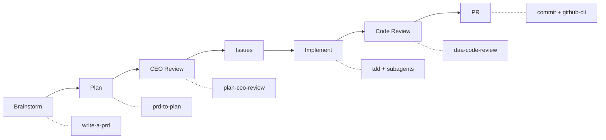
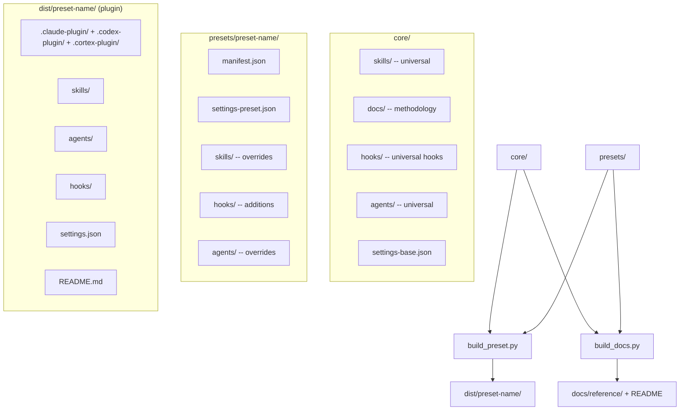

# The Workshop

     

A **portable AI development environment** — skills, methodology docs, agents, and hooks — that installs natively on **Claude Code**, **Codex**, and **Cortex Code** from one shared source. Picked up in seconds by pasting a URL.

<!-- BEGIN GENERATED: counts -->
**28 universal skills · 2 core agents · 8 hooks · 3 project presets · 7 persona plugins**
<!-- END GENERATED: counts -->

> The counts and every component table below are generated from source by `scripts/build_docs.py`. Do not edit them by hand — run `make docs`. Deep reference lives in [`docs/reference/`](docs/reference/).

---

## Table of Contents

- [What Is This](#what-is-this)
- [Reference](#reference)
- [Installation](#installation)
  - [Claude Code](#claude-code)
  - [Codex](#codex)
  - [Cortex Code (CoCo Desktop)](#cortex-code-coco-desktop)
  - [Any Other Agent (Manual Copy)](#any-other-agent-manual-copy)
- [Presets](#presets)
- [Skills](#skills)
  - [Universal Skills](#universal-skills)
  - [Preset-Specific Skills](#preset-specific-skills)
- [Agents](#agents)
  - [Core Agents](#core-agents)
  - [Preset Agents](#preset-agents)
- [Hooks](#hooks)
- [Methodology](#methodology)
- [Dev-Cycle Orchestrator](#dev-cycle-orchestrator)
  - [7-Phase Pipeline](#7-phase-pipeline)
  - [State Management](#state-management)
- [Development](#development)
  - [Architecture](#architecture)
  - [Build Pipeline](#build-pipeline)
  - [Living Documentation](#living-documentation)
  - [Folder Structure](#folder-structure)
  - [Scripts Reference](#scripts-reference)
  - [Running Tests](#running-tests)
- [Troubleshooting](#troubleshooting)
- [Contact](#contact)
- [License](#license)

---

## What Is This

Every coding-agent project needs skills, hooks, settings, and development standards. Setting these up by hand — and keeping them in sync across agents and repos — is repetitive and error-prone.

**The Workshop** solves this. It's a portable dev-environment toolkit that installs natively on **Claude Code**, **Codex**, and **Cortex Code**: the full skill set, every agent, methodology docs, and safety hooks, picked up by pasting a URL. Install **`workbench`** and you get the whole environment configured automatically.

**One shared source, three native outputs.** Every preset builds a plugin manifest for each platform — `.claude-plugin/` (Claude Code), `.codex-plugin/` (Codex), and `.cortex-plugin/` (Cortex Code) — from the same components, with no install-time transform. A preset built here installs and runs the same way on any of the three.

The marketplace ships one main package plus focused extras. **`workbench`** is the everything package: every skill, every agent, all methodology docs, and the safety hooks. Alongside it are five **persona** plugins (voice/output-style layers) and **`vault-ops`** (a domain-specific package). Each maps to a self-contained plugin directory under `dist/`, indexed for Claude Code in `.claude-plugin/marketplace.json` and for Codex in `.agents/plugins/marketplace.json`.

---

## Reference

Complete, always-current reference for every component — generated from source, so it can't drift:

| Reference                                            | What's in it                                              |
| ---------------------------------------------------- | --------------------------------------------------------- |
| [Skills](docs/reference/skills.md)                   | Every universal and preset skill, with full descriptions  |
| [Agents](docs/reference/agents.md)                   | Subagent roles, their skill sets, and preset availability |
| [Hooks](docs/reference/hooks.md)                     | Lifecycle hooks and the events they run on                |
| [Presets](docs/reference/presets.md)                 | What each preset ships, plus its conventions              |
| [Methodology](docs/reference/methodology.md)         | The working-method docs bundled into every preset         |
| [Build & Wiring](docs/reference/build-and-wiring.md) | How the plugin is assembled and how hooks are wired       |

---

## Installation

Every preset builds native plugin manifests for all three platforms from one shared source, so it installs natively wherever you work. Pick your platform below. Most projects want **`workbench`** (the everything package); swap in a persona or `vault-ops` if you prefer.

### Claude Code

Paste the repo URL into Claude and ask for `workbench` (or a specific persona / `vault-ops`):

```
https://github.com/cdcoonce/the-workshop
```

Claude reads `.claude-plugin/marketplace.json`, finds the available packages, and installs the one you select into your project. No cloning or building required.

See [Presets](#presets) for what each package includes, or the [presets reference](docs/reference/presets.md) for full detail.

### Codex

Codex discovers packages from the agents marketplace index at the repo root, `.agents/plugins/marketplace.json`. Every preset ships a native `.codex-plugin/plugin.json` under `dist/<preset-name>/`, so a selected package installs without any Claude-specific translation.

### Cortex Code (CoCo Desktop)

Use the GitHub Plugin Installer with a sub-path to install any preset directly:

```
/github-plugin-installer https://github.com/cdcoonce/the-workshop/tree/main/dist/<preset-name>
```

For example, to install `workbench`:

```
/github-plugin-installer https://github.com/cdcoonce/the-workshop/tree/main/dist/workbench
```

The plugin installs globally to `~/.snowflake/cortex/plugins/<preset-name>/` and activates automatically. Use the Sync button in Agent Settings to pull updates.

> **Prerequisite:** Persona plugins require [`uv`](https://docs.astral.sh/uv/) on PATH for the SessionStart hook.

### Any Other Agent (Manual Copy)

Each `dist/<preset-name>/` is a complete, self-contained plugin — native manifests for all three platforms, plus skills, agents, hooks, settings, and a README. For any agent not listed above, copy the directory into your project:

```bash
# workbench is the everything package; swap for a persona or vault-ops if preferred
cp -r dist/workbench/ /path/to/your-project/.claude/plugins/workbench/
```

---

## Presets

The marketplace ships one everything-package plus focused extras. **`workbench`** carries the complete set — every core skill, every core and preset agent, all methodology docs, and the base hooks plus the auto-format lint hook. **Persona** plugins are output-style-only (voice layers, no skills). **`vault-ops`** is a domain-specific package that ships only its own skills. The table below is generated from each package's manifest.

<!-- BEGIN GENERATED: presets-table -->
| Preset | Kind | Skills | Agents | Conventions |
| --- | --- | --- | --- | --- |
| **`vault-ops`** | project | 21 | 0 | Frontmatter on every note; Wikilinks over bare references; Rebase-before-push git sync, refreshed handoff |
| **`workbench`** | project | 34 | 10 | Test-driven development: write the failing test first; Regenerate docs and dist after changing any component; Progressive disclosure over monolithic instructions; Conventional commits; stage explicitly, never git add .; Repo artifacts stay in-repo; machine-local skill output defaults to ~/.workshop/<skill>/ unless a destination is configured |
| **`workshop-maintainer`** | project | 10 | 6 | Inventory before reorganizing; Keep source ownership distinct from distribution membership; Regenerate docs and dist after changing any component |
| **`advisor-product-design`** | persona | 1 | 0 | Artifact-first: reviews anchor to who the user is and what they decide; Position first, cite the pack, yield only to user evidence; Base/tuning/private layering — local/ is the owner's, never the repo's |
| **`advisor-product-strategy`** | persona | 1 | 0 | Owner drives: 2-3 structural questions, then a committed read in the same message; Steelman duty: the strongest opposing case before endorsing the owner's lean; Base/tuning/private layering — local/ is the owner's, never the repo's |
| **`persona-pair-programmer`** | persona | 0 | 0 | — |
| **`persona-ship-it`** | persona | 0 | 0 | — |
| **`persona-staff-eng-deep`** | persona | 0 | 0 | — |
| **`persona-terse-staff-eng`** | persona | 0 | 0 | — |
| **`persona-thinking-partner`** | persona | 0 | 0 | — |
<!-- END GENERATED: presets-table -->

Each preset's `manifest.json` controls which core components to include, which to exclude, what preset-specific overrides to layer on top, and the `conventions` shown above. See the [presets reference](docs/reference/presets.md) for the skills, agents, and hooks each one ships.

---

## Skills

### Universal Skills

These ship with every preset:

<!-- BEGIN GENERATED: skills-table -->
| Skill | Summary | Presets |
| --- | --- | --- |
| `/commit` | Git commit workflow with enforced conventional commit style. | workbench, workshop-maintainer |
| `/create-hook` | Create and register Claude Code hooks (PreToolUse, PostToolUse) as Python scripts. | workbench |
| `/daa-code-review` | AI-powered code quality analysis for Python, Markdown, and Mermaid diagrams. | workbench, workshop-maintainer |
| `/design-an-interface` | Generate multiple radically different interface designs for a module using parallel sub-agents. | workbench |
| `/dev-cycle` | Use when user says "dev cycle", "development workflow", "full development pipeline", or invokes /dev-cycle to take a GitHub-issues-driven feature from brainstorm through a merged PR. | workbench |
| `/dignified-python` | Production Python coding standards with automatic version detection (3.10-3.13). | workbench |
| `/finish-branch` | Use when implementation is complete, all tests pass, and you need to decide how to integrate a finished development branch — merge, open a PR, keep it, or discard it. | workbench |
| `/github-cli` | GitHub CLI (gh) integration for managing issues, pull requests, branches, commits, and code reviews directly from the terminal. | workbench |
| `/gitlab-cli` | GitLab CLI (glab) integration for managing issues, branches, merge request review, and CI/CD pipelines from the terminal. | workbench |
| `/grill-me` | Interview the user relentlessly about a plan or design until reaching shared understanding, resolving each branch of the decision tree. | workbench, workshop-maintainer |
| `/mr-merge-order` | Use when several MRs or PRs are open against the same branch and the user asks which to merge first, whether one blocks another, why merging one breaks another, or in what order to land a queue. | workbench |
| `/mr-review-fixes` | Use when a user says an MR, PR, merge request, or pull request has review feedback, review comments, changes requested, an approval blocker, or asks to see what needs to be fixed after review. | workbench |
| `/plan-ceo-review` | CEO/founder-mode review that rethinks a plan to find the 10-star product. | workbench |
| `/prd-to-issues` | Break a PRD into independently-grabbable GitHub issues using tracer-bullet vertical slices, with executor-ready issue bodies an autonomous agent can build from directly. | workbench |
| `/prd-to-plan` | Turn a PRD into a multi-phase implementation plan using tracer-bullet vertical slices, saved as a local Markdown file in docs/plans/. | workbench |
| `/project-context` | Generate or update the `.claude/docs/project.md` file that gives Claude project-specific context. | workbench |
| `/readme-generator` | Use when the user asks to create, write, generate, update, improve, or refresh the root README.md of a repository, or asks for a project's front-door / landing documentation. | workbench |
| `/repo-reference-docs` | Create and maintain a thorough, human-readable Markdown reference-docs set for a repository under docs/reference/ — architecture overview, module/directory map, data and control flow, conventions and glossary, plus an index. | workbench |
| `/request-refactor-plan` | Use when user wants to plan a refactor, create a refactoring RFC, break a refactor into safe incremental steps, or find architectural improvement opportunities (deepening shallow modules, consolidating tightly-coupled code, making a codebase more testable or AI-navigable). | workbench |
| `/security-review` | Security code review for vulnerabilities with confidence-based reporting. | workbench |
| `/setup-pre-commit` | Set up pre-commit hooks for the current repo. | workbench |
| `/shared-tree-safety` | Protect work when a git working tree or worktree may be shared with a live autonomous agent or another session. | workbench |
| `/tdd` | Test-driven development with red-green-refactor loop. | workbench, workshop-maintainer |
| `/transcript-notes` | Turn a YouTube lecture/talk or a raw transcript (VTT, SRT, or plain text) into a readable Obsidian-markdown study note — imposed structure, reconstructed LaTeX with plain-word glosses, flagged missing visuals, and per-section reading prompts. | workbench |
| `/triage-issue` | Use when user reports a bug, wants to file an issue, mentions "triage", or wants to investigate and plan a fix for a problem. | workbench |
| `/triage-quarantine` | Diagnose why an autonomous agent run failed, quarantined, or was rejected before re-running anything. | workbench |
| `/using-workflow` | Use when starting any conversation or task in this project — establishes precedence between instructions and skills, requires invoking any skill that might apply, and sets the order skills run in before any response or action. | workbench, workshop-maintainer |
| `/write-a-prd` | Use when user wants to write a PRD, create a product requirements document, or plan a new feature. | workbench |
<!-- END GENERATED: skills-table -->

### Preset-Specific Skills

These ship only with the presets that declare them:

<!-- BEGIN GENERATED: preset-skills-table -->
| Skill | Summary | Presets |
| --- | --- | --- |
| `/add-the-workshop-hook` | Design and ship a new core hook in this repo (the-workshop) — fetch the exact event schema, write a stdlib-only fail-open script, TDD it against real subprocess+git behavior, wire it into every affected preset, and push to both GitHub and GitLab. | workshop-maintainer |
| `/advisor-product-design` | Product-design and UI/UX advisor for an engineer who ships real interfaces — data apps, dashboards, mobile, web. | advisor-product-design |
| `/advisor-product-strategy` | Product-strategy sounding board and coach for a design+PM hybrid at an early-stage startup — decision stress-testing, influence-case building, prioritization on thin evidence, and verdict-first design critique. | advisor-product-strategy |
| `/chart-taste` | Applies chart-design taste to React data visualization — a chart-type decision tree and adjustable dials (annotation density, complexity, color restraint) to stop charts from being technically-rendered-but-uninformative. | workbench |
| `/dagster-expert` | Expert guidance for working with Dagster and the dg CLI. | workbench |
| `/dbt-expert` | Expert guidance for working with dbt Core. | workbench |
| `/gitlab-mr-create` | Create GitLab merge requests with `glab` using the `HEAD` conventional-commit subject as the exact title, a Markdown description file with real newlines, and API read-back verification. | workbench |
| `/gitlab-promotion-flow` | Integration and promotion policy for Clearway GitLab data repos (Dagster, dbt, ingestion). | workbench |
| `/improve-skill` | Use when user says "improve skill", "benchmark skill", "make skill better", or invokes /improve-skill to raise a skill's benchmark pass rate before merging a PR. | workshop-maintainer |
| `/persona-builder` | Build an installable, portable, self-tuning coach/sounding-board persona for a named owner. | workshop-maintainer |
| `/react-ui-ux` | Applies deliberate design taste to React UI generation — adjustable dials (variance, motion, density) and explicit anti-genericness rules to stop AI-generated components from defaulting to the generic shadcn/Tailwind look. | workbench |
| `/skill-inventory` | Audits agent skills and their package boundaries. | workshop-maintainer |
| `/vault-audit` | Run Charles's vault (The Vault) /vault-audit structural audit across frontmatter, wikilinks, indexes, stale notes, duplicates, and templates. | vault-ops |
| `/vault-budget` | Run Charles's vault (The Vault) /budget spend and subscription-value meter from local Claude transcripts. | vault-ops |
| `/vault-clickup-task-sync` | Run Charles's vault (The Vault) /clickup-task-sync workflow to sync vault action items into ClickUp without duplicating tasks. | vault-ops |
| `/vault-connect` | Run Charles's vault (The Vault) /connect autonomous graph connection pass with preview-gated wikilink edits. | vault-ops |
| `/vault-context-then-delegate` | Run Charles's vault (The Vault) /context-then-delegate workflow to resolve real-world ambiguity (email/SharePoint/Slack) before writing a coding-agent prompt. | vault-ops |
| `/vault-dispatch` | Run Charles's vault (The Vault) /dispatch workflow to turn a shaped idea into an afk-managed issue linked back into the vault. | vault-ops |
| `/vault-dump` | Run Charles's vault (The Vault) /dump capture workflow for routing freeform input into durable vault notes, tasks, indexes, and wikilinks. | vault-ops |
| `/vault-essay` | Draft long-form prose (essays and posts) in Charles's voice using The Vault's /essay writing rules. | vault-ops |
| `/vault-find` | Run Charles's vault (The Vault) /find semantic vault search workflow, including reindex and status modes. | vault-ops |
| `/vault-fix-issue` | Run Charles's vault (The Vault) /fix-issue workflow to resolve a filed issue under TDD + mutation-teeth-check + review-before-commit discipline. | vault-ops |
| `/vault-garden` | Run Charles's vault (The Vault) /garden graph-gardener apply workflow for queued link, profile, memory, index, and orphan repairs. | vault-ops |
| `/vault-grill` | Run Charles's vault (The Vault) /grill active knowledge-extraction interview and route the result into the vault graph. | vault-ops |
| `/vault-handoff` | Run Charles's vault (The Vault) /handoff workflow to refresh the machine-scoped rolling handoff digest. | vault-ops |
| `/vault-link` | Run Charles's vault (The Vault) /link helper to find notes and suggest or insert correct Obsidian wikilinks. | vault-ops |
| `/vault-mr-review-packet` | Run Charles's vault (The Vault) /mr-review-packet workflow to generate a self-guided reviewer packet for a large merge request. | vault-ops |
| `/vault-recall` | Run Charles's vault (The Vault) /recall post-build consolidation workflow for afk merge outcomes, stubs, brag candidates, and handoff refresh. | vault-ops |
| `/vault-standup` | Run Charles's vault (The Vault) /standup context-loading workflow, including lean, deep, and comprehensive modes. | vault-ops |
| `/vault-sync` | Run Charles's vault (The Vault) /sync git synchronization workflow with rebase-before-push and conflict-safe handling. | vault-ops |
| `/vault-teach` | Run Charles's vault (The Vault) /teach stateful learning workspace workflow for a topic. | vault-ops |
| `/vault-wrap-up` | Run Charles's vault (The Vault) /wrap-up session audit, handoff refresh, and git sync workflow. | vault-ops |
| `/vault-write` | Draft Outlook or Teams messages in Charles's voice using The Vault's /write communication rules. | vault-ops |
| `/workshop-skill-creator` | Creates and revises skills owned by The Workshop repository. | workshop-maintainer |
<!-- END GENERATED: preset-skills-table -->

Full descriptions for every skill live in the [skills reference](docs/reference/skills.md).

---

## Agents

Agents are specialized role definitions (`AGENT.md` with YAML frontmatter) that give subagents domain expertise. Each agent is self-contained — it declares a **role** (`implementer`, `reviewer`, etc.) and its own skill set directly via `skills.add`/`skills.remove` in the frontmatter. A preset agent with the same name as a core agent **replaces** it (override semantics, not merge).

### Core Agents

These ship with every preset:

<!-- BEGIN GENERATED: agents-core-table -->
| Agent | Role | Skills | Presets |
| --- | --- | --- | --- |
| **code-reviewer** | `reviewer` | `daa-code-review`, `dignified-python` | workbench |
| **tdd-implementer** | `implementer` | `tdd`, `commit`, `dignified-python` | workbench |
<!-- END GENERATED: agents-core-table -->

### Preset Agents

Each preset adds domain-specific agents that override or extend the core set:

<!-- BEGIN GENERATED: agents-preset-table -->
| Agent | Role | Skills | Presets |
| --- | --- | --- | --- |
| **analysis-builder** | `implementer` | `tdd`, `commit` | workbench |
| **api-builder** | `implementer` | `tdd`, `commit` | workbench |
| **backend-builder** | `implementer` | `tdd`, `commit` | workbench |
| **data-quality-reviewer** | `reviewer` | `daa-code-review`, `dagster-expert`, `dbt-expert`, `dignified-python` | workbench |
| **frontend-builder** | `implementer` | `tdd`, `commit`, `react-ui-ux` | workbench |
| **pipeline-builder** | `implementer` | `tdd`, `commit`, `dagster-expert`, `dbt-expert`, `dignified-python` | workbench |
| **qa-tester** | `qa-tester` | — | workshop-maintainer |
| **security-reviewer** | `reviewer` | `daa-code-review` | workbench |
| **skill-analyst** | `analyst` | — | workshop-maintainer |
| **skill-builder** | `implementer` | `tdd`, `commit` | workshop-maintainer |
| **skill-reviewer** | `reviewer` | `daa-code-review` | workshop-maintainer |
| **skill-writer** | `skill-writer` | — | workshop-maintainer |
| **strategy** | `strategy` | — | workshop-maintainer |
| **ux-reviewer** | `reviewer` | `daa-code-review` | workbench |
<!-- END GENERATED: agents-preset-table -->

See the [agents reference](docs/reference/agents.md) for full descriptions.

---

## Hooks

Hooks are scripts wired to Claude Code lifecycle events. The base set ships with every project preset; personas wire only their SessionStart injector. The event column is derived from the settings wiring, not the hook's name.

<!-- BEGIN GENERATED: hooks-table -->
| Hook | Event | Summary | Presets |
| --- | --- | --- | --- |
| `audit-config-change.py` | `ConfigChange` | ConfigChange hook: audit-log and surface mid-session config file changes. | all |
| `inject-skill-router.py` | `SessionStart` | SessionStart hook: inject the skill router and preset conventions as additionalContext. | all |
| `inject_persona.py` | `SessionStart` | SessionStart hook: inject a persona output-style as additionalContext. | persona-pair-programmer, persona-ship-it, persona-staff-eng-deep, persona-terse-staff-eng, persona-thinking-partner |
| `post-edit-lint.py` | `PostToolUse` | Post-edit hook: auto-format and lint edited files with whatever toolchain is | workbench |
| `protect-files.py` | `PreToolUse` | Pre-edit hook: block edits to sensitive/generated files. | all |
| `snapshot-subagent-start.py` | `SubagentStart` | SubagentStart hook: record a git baseline for the evidence check at stop. | all |
| `verify-subagent-evidence.py` | `SubagentStop` | SubagentStop hook: catch a subagent claiming a change it never made. | all |
| `verify-tests-before-stop.py` | `Stop` | Stop hook: verify the project's test suite is green before Claude stops. | all |
<!-- END GENERATED: hooks-table -->

See the [hooks reference](docs/reference/hooks.md) and [build & wiring reference](docs/reference/build-and-wiring.md) for details.

---

## Methodology

Methodology documents in `core/docs/` define how Claude Code agents should work. They are bundled into every preset under `docs/`:

<!-- BEGIN GENERATED: methodology-table -->
| Document | Summary |
| --- | --- |
| [`agent-matching.md`](../../core/docs/agent-matching.md) | This document is the canonical specification for how orchestrators select agents when dispatching subagents. All orchestrators — dev-cycle, subagent-development, parallel-agents — follow this algorithm. |
| [`parallel-agents.md`](../../core/docs/parallel-agents.md) | When you have multiple unrelated failures (different test files, different subsystems, different bugs), investigating them sequentially wastes time. Each investigation is independent and can happen in parallel. |
| [`root-cause-tracing.md`](../../core/docs/root-cause-tracing.md) | Bugs often manifest deep in the call stack (file created in wrong location, database opened with wrong path). Your instinct is to fix where the error appears, but that's treating a symptom. |
| [`subagent-development.md`](../../core/docs/subagent-development.md) | Execute a plan by dispatching a fresh subagent per task, with code review after each. |
| [`tdd.md`](../../core/docs/tdd.md) | Write the test first. Watch it fail. Write minimal code to pass. |
<!-- END GENERATED: methodology-table -->

Full summaries are in the [methodology reference](docs/reference/methodology.md).

---

## Dev-Cycle Orchestrator

The `/dev-cycle` skill orchestrates end-to-end feature development through GitHub issues.

### 7-Phase Pipeline



Every phase is mandatory. Each phase gates on a specific artifact (issue URL, plan file, approval, etc.) before advancing.

### State Management

- **State files** live at `docs/dev-cycle/{slug}.state.md` with YAML frontmatter
- **Resume** across conversations — scan for `status: in_progress` files
- **Archive** on completion — `git mv` state + plan files to `docs/archive/`
- **Backwards transitions** supported: `implement → plan` or `code_review → plan` when architectural issues arise

---

## Development

This section is for contributors who want to build presets from source, add new presets, or modify core components.

### Prerequisites

- **Python 3.12+**
- **[uv](https://docs.astral.sh/uv/)** — Python package manager

```bash
git clone https://github.com/cdcoonce/the-workshop.git
cd the-workshop
uv sync
```

### Architecture



Key design decisions:

- **Plugin format** — Output is a self-contained plugin that ships a native manifest for each platform (`.claude-plugin/`, `.codex-plugin/`, `.cortex-plugin/`)
- **Override semantics** — A preset skill or agent with the same name as a core one **replaces** it entirely
- **Settings merge** — Base and preset JSON are shallow-merged; hook arrays are appended, not replaced
- **Fail-fast validation** — All manifest references are checked upfront before any files are copied
- **Path containment safety** — Exclusion paths are resolved and verified to prevent directory traversal
- **Marketplace index** — `.claude-plugin/marketplace.json` lists all available plugins with their `dist/` sources, enabling Claude to discover and install presets by URL
- **Generated docs** — `build_docs.py` renders the reference and README component tables from source, gated on staleness so they can't drift

### Build Pipeline

The build script assembles a self-contained plugin directory:

```mermaid
flowchart LR
    A[Read manifest.json] --> B[Validate references]
    B --> C[Copy core skills/agents]
    C --> D[Copy preset skills/agents -- overrides core]
    D --> E[Copy hook scripts]
    E --> F[Generate hooks/hooks.json]
    F --> G[Generate settings.json]
    G --> H[Generate plugin manifests]
    H --> I[Apply exclusions]
    I --> J[Generate README.md]
    J --> K["dist/{preset}/ (plugin)"]
```



### Living Documentation

The reference docs and the README component tables are **generated from source**, not hand-maintained, so they can't drift from the components as the repo evolves.

- `make docs` runs `scripts/build_docs.py`, which reads SKILL.md/AGENT.md frontmatter, hook docstrings, settings wiring, and preset manifests, then writes the `docs/reference/` catalogs and rewrites the `<!-- BEGIN/END GENERATED -->` regions of this README and `docs/reference/build-and-wiring.md`.
- `make build` regenerates the marketplace index and rebuilds every preset into `dist/`.
- `make test` runs the suites **and** the drift gate: it runs `build_docs --check`, rebuilds `dist/`, and fails if any generated output differs from what's committed. The same gate runs in CI.

When you add or change a skill, hook, agent, or preset, run `make docs && make build && make test` and commit the regenerated docs and `dist/` alongside your change. The maintainer skills (`workshop-skill-creator`, `add-the-workshop-hook`) end with this step; `create-hook` remains the general-purpose hook workflow.

### Folder Structure

```
the-workshop/
├── .claude-plugin/
│   └── marketplace.json     # Plugin registry — lists all presets with dist/ sources
├── .github/workflows/       # CI — runs make test (suites + drift gate)
├── core/                    # Universal components shared by all presets
│   ├── settings-base.json   # Base hook configuration
│   ├── agents/              # Universal agents
│   ├── docs/                # Methodology docs (TDD, root-cause, subagent, parallel, agent-matching)
│   ├── hooks/               # Universal hook scripts
│   └── skills/              # Universal skills
├── presets/                  # Project-type configurations (+ persona plugins)
├── scripts/                 # Build, docs, marketplace, smoke-test, validation tooling
├── tests/                   # pytest suite
├── dist/                    # Built plugins (committed, gated against drift)
├── docs/
│   ├── reference/           # Generated component reference (skills, hooks, agents, presets, ...)
│   ├── plans/               # Plans and archives
│   └── dev-cycle/           # Dev-cycle state
└── .claude/                 # Self-applicable template (dogfooding)
```

### Scripts Reference

| Command                                                       | Description                                                      |
| ------------------------------------------------------------- | ---------------------------------------------------------------- |
| `make docs`                                                   | Regenerate `docs/reference/` and the README's generated tables   |
| `make build`                                                  | Regenerate the marketplace and rebuild every preset into `dist/` |
| `make test`                                                   | Run the suites plus the docs+dist drift gate                     |
| `uv run python -m scripts.build_docs [--check]`               | Generate docs, or check for staleness (`--check`)                |
| `uv run python -m scripts.build_preset <preset>`              | Assemble core + preset into `dist/<preset>/`                     |
| `uv run python -m scripts.build_marketplace`                  | Regenerate `.claude-plugin/marketplace.json`                     |
| `uv run python -m scripts.smoke_test <preset>`                | Validate internal consistency of a built preset                  |
| `uv run python -m scripts.dev_cycle_validate docs/dev-cycle/` | Validate dev-cycle state file frontmatter and phase transitions  |

### Running Tests

```bash
# Full gate (suites + drift check)
make test

# Just the root pytest suite
uv run pytest

# With coverage
uv run pytest --cov=scripts --cov-report=term-missing
```

---

## Troubleshooting

| Symptom                                         | Likely Cause                                                                            | Fix                                                                    |
| ----------------------------------------------- | --------------------------------------------------------------------------------------- | ---------------------------------------------------------------------- |
| `build_preset.py` fails with "skill not found"  | Manifest references a skill that doesn't exist in `core/skills/` or `presets/*/skills/` | Check `manifest.json` `preset_skills` array against actual directories |
| `make test` fails with "Documentation is stale" | A component changed but docs/dist weren't regenerated                                   | Run `make docs && make build` and commit the regenerated output        |
| Smoke test reports missing hook                 | Hook listed in `hooks.json` but script not in `hooks/scripts/`                          | Add the hook script or remove from settings                            |
| Dev-cycle state file validation fails           | Frontmatter schema mismatch or phase transition error                                   | Check `schema_version: 1` and that phases follow strict order          |

---

## Contact

For questions or support, contact:

- **Charles Coonce** — Charles.Coonce@clearwayenergy.com

---

## License

**Internal Use Only — Clearway Energy**

Proprietary software. All rights reserved.
