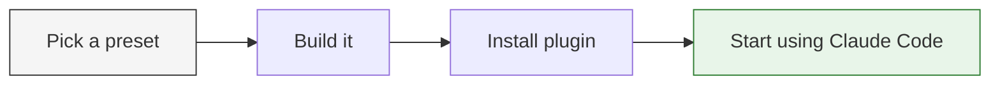
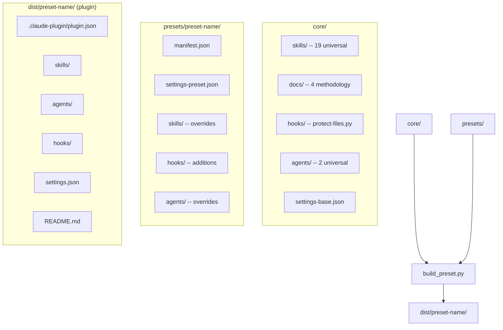
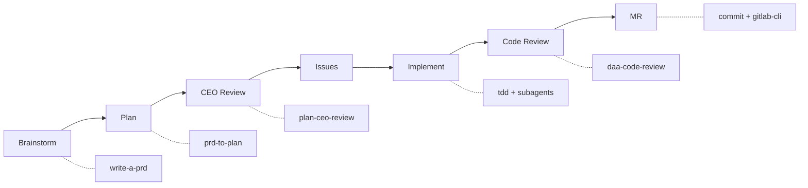

# Claude Workflow

     

A **template system for Claude Code plugins** shared across the team. Build a preset for your project type, install it as a Claude Code plugin, and get a fully configured environment with 19 skills, methodology docs, agents, and hooks -- ready to go in seconds.

---

## Table of Contents

- [Quick Start: Install a Plugin](#quick-start-install-a-plugin)
- [Overview](#overview)
- [Architecture](#architecture)
  - [High-Level Architecture](#high-level-architecture)
  - [Folder Structure](#folder-structure)
  - [Build Pipeline](#build-pipeline)
- [Getting Started](#getting-started)
  - [Prerequisites](#prerequisites)
  - [Installation](#installation)
  - [Running Tests](#running-tests)
- [Usage](#usage)
  - [Build a Preset](#build-a-preset)
  - [Build Marketplace Index](#build-marketplace-index)
  - [Smoke Test a Built Preset](#smoke-test-a-built-preset)
  - [Validate Dev-Cycle State Files](#validate-dev-cycle-state-files)
- [Presets](#presets)
- [Skills](#skills)
  - [Universal Skills (19)](#universal-skills-19)
  - [Preset-Specific Skills](#preset-specific-skills)
- [Agents](#agents)
  - [Core Agents](#core-agents)
  - [Preset Agents](#preset-agents)
- [Methodology](#methodology)
- [Dev-Cycle Orchestrator](#dev-cycle-orchestrator)
  - [7-Phase Pipeline](#7-phase-pipeline)
  - [State Management](#state-management)
- [Troubleshooting](#troubleshooting)
- [Contact](#contact)
- [License](#license)

---

## Quick Start: Install a Plugin

Already have the repo cloned? Pick a preset and go:

```bash
# 1. Build the preset that matches your project type
uv run python -m scripts.build_preset python-api

# 2. Install the plugin into your project
#    (copy the built plugin directory or symlink it)
cp -r dist/python-api/ /path/to/your-project/.claude/plugins/python-api/

# 3. Done -- Claude Code now has 19 skills, agents, hooks, and methodology docs
```



**Available presets:** `python-api` | `data-pipeline` | `full-stack` | `claude-tooling` | `analysis`

See [Presets](#presets) for details on what each one includes.

---

## Overview

Every new project that uses **Claude Code** needs skills, hooks, settings, and development standards. Setting these up manually is repetitive and error-prone.

**Claude Workflow** solves this with a layered plugin system:

1. **Core** -- 19 universal skills, 2 agents, 4 methodology docs, and a file-protection hook that apply to every project
2. **Presets** -- Named configurations (e.g., `python-api`, `full-stack`) that add project-type-specific skills, hooks, and agents
3. **Build tooling** -- Python scripts that assemble core + preset into a self-contained Claude Code plugin in `dist/`

The result is a consistent, tested Claude Code plugin that can be installed into any new repo in seconds.

---

## Architecture

### High-Level Architecture



### Folder Structure

```
claude-workflow/
├── core/                    # Universal components shared by all presets
│   ├── settings-base.json   # Base hook configuration
│   ├── agents/              # 2 universal agents (tdd-implementer, code-reviewer)
│   ├── docs/                # TDD, root-cause tracing, subagent, parallel agents
│   ├── hooks/               # File protection hook
│   └── skills/              # 19 universal skills
├── presets/                  # Project-type configurations
│   ├── python-api/          # Python backend services (+ api-builder, security-reviewer)
│   ├── data-pipeline/       # ETL/ELT pipelines (+ pipeline-builder, data-quality-reviewer)
│   ├── full-stack/          # React/Next.js + Python (+ frontend/backend-builder, ux-reviewer)
│   ├── claude-tooling/      # Claude skill/hook development (+ skill-builder, skill-reviewer)
│   └── analysis/            # Notebooks, statistical analysis (+ analysis-builder)
├── scripts/                 # Build, marketplace, smoke-test, validation tooling
├── tests/                   # 93 pytest tests
├── dist/                    # Build output (gitignored)
├── docs/                    # Plans, archives, dev-cycle state
└── .claude/                 # Self-applicable template (dogfooding)
```

### Build Pipeline

The build script assembles a self-contained plugin directory in 10 steps:

```mermaid
flowchart LR
    A[Read manifest.json] --> B[Validate references]
    B --> C[Copy core skills/agents]
    C --> D[Copy preset skills/agents -- overrides core]
    D --> E[Copy hook scripts]
    E --> F[Generate hooks/hooks.json]
    F --> G[Generate settings.json]
    G --> H[Generate .claude-plugin/plugin.json]
    H --> I[Generate README.md]
    I --> J[Apply exclusions]
    J --> K["dist/{preset}/ (plugin)"]
```



Key design decisions:
- **Plugin format** -- Output is a self-contained Claude Code plugin with `.claude-plugin/plugin.json`
- **Override semantics** -- A preset skill or agent with the same name as a core one **replaces** it entirely
- **Settings merge** -- Base and preset JSON are shallow-merged; hook arrays are appended, not replaced
- **Fail-fast validation** -- All manifest references are checked upfront before any files are copied
- **Path containment safety** -- Exclusion paths are resolved and verified to prevent directory traversal

---

## Getting Started

### Prerequisites

- **Python 3.12+**
- **[uv](https://docs.astral.sh/uv/)** — Python package manager
- **Claude Code** — Anthropic's CLI for Claude (to use the built configurations)

### Installation

```bash
git clone https://gitlab.com/clearwayenergy-group/data-architecture-and-analytics/ai-tools/claude-workflow
cd claude-workflow
uv sync
```

### Running Tests

```bash
# Run all tests
uv run pytest

# Run with coverage
uv run pytest --cov=scripts --cov-report=term-missing
```

---

## Usage

### Build a Preset

Assemble core + preset into a self-contained plugin directory:

```bash
uv run python -m scripts.build_preset python-api
```

Output lands in `dist/python-api/` as a complete Claude Code plugin. Install it by copying the directory to your target project's plugin location:

```bash
cp -r dist/python-api/ /path/to/your-project/.claude/plugins/python-api/
```

### Build Marketplace Index

Generate a `marketplace.json` listing all available plugins:

```bash
uv run python -m scripts.build_marketplace
```

Output lands at `.claude-plugin/marketplace.json` in the repo root.

### Smoke Test a Built Preset

Validate internal consistency after building:

```bash
uv run python -m scripts.smoke_test python-api
```

Checks that `.claude-plugin/plugin.json` has required fields, every skill has a `SKILL.md`, every agent has valid `AGENT.md` frontmatter, hook scripts referenced in `hooks.json` exist, and `settings.json` is valid JSON.

### Validate Dev-Cycle State Files

```bash
uv run python -m scripts.dev_cycle_validate docs/dev-cycle/
```

Validates YAML frontmatter, phase transitions, artifact completeness, and slug uniqueness across all `*.state.md` files.

---

## Presets

| Preset               | Target                                  | Preset Skills                | Preset Agents                                        | Key Conventions                            |
| -------------------- | --------------------------------------- | ---------------------------- | ---------------------------------------------------- | ------------------------------------------ |
| **`python-api`**     | Lambda, FastAPI, Flask backends         | `deploy`, `setup-pre-commit` | `api-builder`, `security-reviewer`                   | Ruff linting, structured logging           |
| **`data-pipeline`**  | ETL/ELT, SQL transforms, scheduled jobs | —                            | `pipeline-builder`, `data-quality-reviewer`          | SQL lowercase, idempotent stages           |
| **`full-stack`**     | React/Next.js + Python backend          | `setup-pre-commit`           | `frontend-builder`, `backend-builder`, `ux-reviewer` | Dual test runners, fixture patterns        |
| **`claude-tooling`** | Claude skills, hooks, agents            | —                            | `skill-builder`, `skill-reviewer`                    | Skill structure requirements               |
| **`analysis`**       | Notebooks, R/Python scripts             | —                            | `analysis-builder`                                   | Reproducible seeds, documented assumptions |

Each preset's `manifest.json` controls which core components to include, which to exclude, and what preset-specific overrides to layer on top. All presets inherit the full set of 19 core skills, 2 core agents, 4 methodology docs, and the file-protection hook.

---

## Skills

### Universal Skills (19)

These ship with every preset:

| Skill                            | Trigger                             | Description                                   |
| -------------------------------- | ----------------------------------- | --------------------------------------------- |
| `/commit`                        | "commit", "save work"               | Conventional commit style enforcement         |
| `/daa-code-review`               | "code review", "quality check"      | Python, Markdown, and Mermaid analysis        |
| `/design-an-interface`           | "design it twice", API design       | Parallel sub-agents for interface comparison  |
| `/dev-cycle`                     | "dev cycle", "development workflow" | Full 7-phase GitLab-issues-driven pipeline    |
| `/gitlab-cli`                    | GitLab operations                   | Issues, MRs, branches, reviews via `glab`     |
| `/grill-me`                      | "grill me", stress-test a plan      | Systematic interrogation via AskUserQuestion  |
| `/improve-codebase-architecture` | architecture improvement            | Deep-module refactoring opportunities         |
| `/plan-ceo-review`               | "CEO review", "mega review"         | 3-mode plan review (expand/hold/reduce scope) |
| `/prd-to-issues`                 | "convert PRD to issues"             | Vertical-slice GitLab issue creation          |
| `/prd-to-plan`                   | "break down PRD", "tracer bullets"  | Multi-phase implementation planning           |
| `/project-context`               | "update project.md"                 | Generate `.claude/docs/project.md`            |
| `/readme-generator`              | "README", "document this project"   | Codebase analysis + README generation         |
| `/request-refactor-plan`         | "plan a refactor"                   | Tiny-commit refactor RFC as GitLab issue      |
| `/setup-pre-commit`              | "set up pre-commit"                 | Pre-commit hooks for linting and formatting   |
| `/tdd`                           | "red-green-refactor", TDD           | Test-driven development loop                  |
| `/triage-issue`                  | "triage", bug report                | Root-cause investigation + issue creation     |
| `/write-a-prd`                   | "write a PRD"                       | Interview-driven PRD as GitLab issue          |
| `/write-a-skill`                 | "create a skill"                    | Skill authoring with proper structure         |

### Preset-Specific Skills

| Preset       | Skill               | Description                       |
| ------------ | ------------------- | --------------------------------- |
| `python-api` | `/deploy`           | Lambda/service deployment         |

---

## Agents

Agents are specialized role definitions (`AGENT.md` with YAML frontmatter) that give subagents domain expertise. Each agent is self-contained -- it declares a **role** (`implementer` or `reviewer`) and its own skill set directly via `skills.add`/`skills.remove` in the frontmatter.

### Core Agents

These ship with every preset:

| Agent                 | Role          | Skills            | Description                                      |
| --------------------- | ------------- | ----------------- | ------------------------------------------------ |
| **`tdd-implementer`** | `implementer` | `tdd`, `commit`   | Implements features using red-green-refactor TDD |
| **`code-reviewer`**   | `reviewer`    | `daa-code-review` | Reviews code for quality, structure, correctness |

### Preset Agents

Each preset adds domain-specific agents that override or extend the core set:

| Preset           | Agent                       | Role          | Description                          |
| ---------------- | --------------------------- | ------------- | ------------------------------------ |
| `python-api`     | **`api-builder`**           | `implementer` | FastAPI/Flask/Lambda specialist      |
| `python-api`     | **`security-reviewer`**     | `reviewer`    | Security-focused code review         |
| `data-pipeline`  | **`pipeline-builder`**      | `implementer` | ETL/ELT pipeline construction        |
| `data-pipeline`  | **`data-quality-reviewer`** | `reviewer`    | Data validation and quality review   |
| `full-stack`     | **`frontend-builder`**      | `implementer` | React/Next.js frontend development   |
| `full-stack`     | **`backend-builder`**       | `implementer` | Python backend API development       |
| `full-stack`     | **`ux-reviewer`**           | `reviewer`    | UX and accessibility review          |
| `claude-tooling` | **`skill-builder`**         | `implementer` | Claude skill/hook/MCP development    |
| `claude-tooling` | **`skill-reviewer`**        | `reviewer`    | Skill correctness and best practices |
| `analysis`       | **`analysis-builder`**      | `implementer` | Data analysis and notebook workflows |

A preset agent with the same name as a core agent **replaces** it (override semantics, not merge).

---

## Methodology

Four methodology documents in `core/docs/` define how Claude Code agents should work:

| Methodology              | Core Principle                                                               |
| ------------------------ | ---------------------------------------------------------------------------- |
| **TDD**                  | Write the test first. Watch it fail. Write minimal code to pass.             |
| **Root Cause Tracing**   | Never fix at the symptom. Trace backward to the original trigger.            |
| **Subagent Development** | Dispatch a fresh subagent per task with code review between each.            |
| **Parallel Agents**      | When 3+ unrelated failures need investigation, one agent per problem domain. |

---

## Dev-Cycle Orchestrator

The `/dev-cycle` skill orchestrates end-to-end feature development through GitLab issues.

### 7-Phase Pipeline



Every phase is mandatory. Each phase gates on a specific artifact (issue URL, plan file, approval, etc.) before advancing.

### State Management

- **State files** live at `docs/dev-cycle/{slug}.state.md` with YAML frontmatter
- **Resume** across conversations — scan for `status: in_progress` files
- **Archive** on completion — `git mv` state + plan files to `docs/archive/`
- **Backwards transitions** supported: `implement → plan` or `code_review → plan` when architectural issues arise

---

## Troubleshooting

| Symptom                                        | Likely Cause                                                                            | Fix                                                                    |
| ---------------------------------------------- | --------------------------------------------------------------------------------------- | ---------------------------------------------------------------------- |
| `build_preset.py` fails with "skill not found" | Manifest references a skill that doesn't exist in `core/skills/` or `presets/*/skills/` | Check `manifest.json` `preset_skills` array against actual directories |
| Smoke test reports missing hook                | Hook listed in `hooks.json` but script not in `hooks/scripts/`                          | Add the hook script or remove from settings                            |
| Dev-cycle state file validation fails          | Frontmatter schema mismatch or phase transition error                                   | Check `schema_version: 1` and that phases follow strict order          |
| macOS "` 2`" duplicate files appear            | Prettier hook reformats files, then `git checkout` conflicts                            | Already mitigated via `.prettierrc` + `.gitignore` patterns            |

---

## Contact

For questions or support, contact:

- **Charles Coonce** — Charles.Coonce@clearwayenergy.com

---

## License

**Internal Use Only — Clearway Energy**

Proprietary software. All rights reserved.
