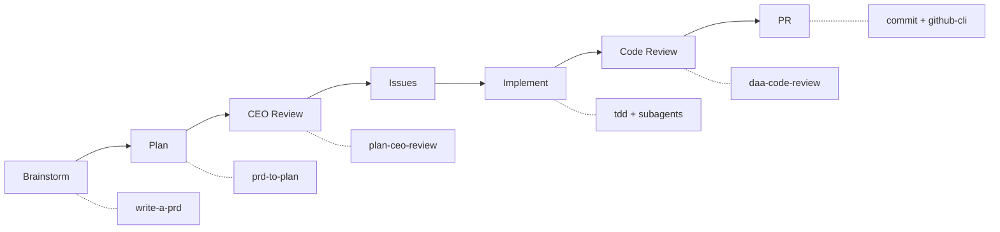
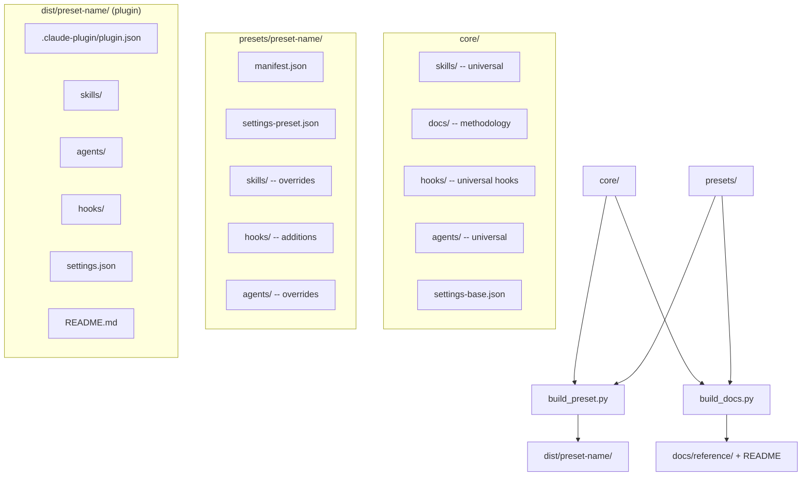

# Claude Workflow

     

A **Claude Code plugin** that gives any project a fully configured AI development environment — skills, methodology docs, agents, and hooks — picked up in seconds by pasting a URL.

<!-- BEGIN GENERATED: counts -->
**24 universal skills · 6 core agents · 7 hooks · 7 project presets · 5 persona plugins**
<!-- END GENERATED: counts -->

> The counts and every component table below are generated from source by `scripts/build_docs.py`. Do not edit them by hand — run `make docs`. Deep reference lives in [`docs/reference/`](docs/reference/).

---

## Table of Contents

- [What Is This](#what-is-this)
- [Reference](#reference)
- [Installation](#installation)
  - [Claude (Primary)](#claude-primary)
  - [Cortex Code (CoCo Desktop)](#cortex-code-coco-desktop)
  - [Other Agents (Manual Copy-Paste)](#other-agents-manual-copy-paste)
- [Presets](#presets)
- [Skills](#skills)
  - [Universal Skills](#universal-skills)
  - [Preset-Specific Skills](#preset-specific-skills)
- [Agents](#agents)
  - [Core Agents](#core-agents)
  - [Preset Agents](#preset-agents)
- [Hooks](#hooks)
- [Methodology](#methodology)
- [Dev-Cycle Orchestrator](#dev-cycle-orchestrator)
  - [7-Phase Pipeline](#7-phase-pipeline)
  - [State Management](#state-management)
- [Development](#development)
  - [Architecture](#architecture)
  - [Build Pipeline](#build-pipeline)
  - [Living Documentation](#living-documentation)
  - [Folder Structure](#folder-structure)
  - [Scripts Reference](#scripts-reference)
  - [Running Tests](#running-tests)
- [Troubleshooting](#troubleshooting)
- [Contact](#contact)
- [License](#license)

---

## What Is This

Every project that uses **Claude Code** needs skills, hooks, settings, and development standards. Setting these up manually is repetitive and error-prone.

**Claude Workflow** is a Claude Code plugin that solves this. Paste the repo URL into Claude, pick a preset, and you get a fully configured environment with a full skill set, domain-specific agents, methodology docs, and hooks — installed automatically.

The plugin is organized into **presets** for different project types. Each preset is listed in `.claude-plugin/marketplace.json` and maps to a self-contained plugin directory under `dist/`. Claude reads this marketplace index and can install any preset on demand.

For teams using non-Claude agents (OpenAI, Cursor, etc.), the `dist/` output can also be copied manually.

---

## Reference

Complete, always-current reference for every component — generated from source, so it can't drift:

| Reference | What's in it |
| --- | --- |
| [Skills](docs/reference/skills.md) | Every universal and preset skill, with full descriptions |
| [Agents](docs/reference/agents.md) | Subagent roles, their skill sets, and preset availability |
| [Hooks](docs/reference/hooks.md) | Lifecycle hooks and the events they run on |
| [Presets](docs/reference/presets.md) | What each preset ships, plus its conventions |
| [Methodology](docs/reference/methodology.md) | The working-method docs bundled into every preset |
| [Build & Wiring](docs/reference/build-and-wiring.md) | How the plugin is assembled and how hooks are wired |

---

## Installation

### Claude (Primary)

Paste the repo URL into Claude and tell it which preset you want:

```
https://github.com/cdcoonce/claude-workflow
```

Claude will read `.claude-plugin/marketplace.json`, find the available presets, and install the one you select into your project. No cloning or building required.

See [Presets](#presets) for what each one includes, or the [presets reference](docs/reference/presets.md) for full detail.

### Cortex Code (CoCo Desktop)

Use the GitHub Plugin Installer with a sub-path to install any preset directly:

```
/github-plugin-installer https://github.com/cdcoonce/claude-workflow/tree/main/dist/<preset-name>
```

For example, to install the `full-stack` preset:

```
/github-plugin-installer https://github.com/cdcoonce/claude-workflow/tree/main/dist/full-stack
```

The plugin installs globally to `~/.snowflake/cortex/plugins/<preset-name>/` and activates automatically. Use the Sync button in Agent Settings to pull updates.

> **Prerequisite:** Persona plugins require [`uv`](https://docs.astral.sh/uv/) on PATH for the SessionStart hook.

### Other Agents (Manual Copy-Paste)

For non-Claude agents, copy the pre-built plugin directory directly into your project:

```bash
# Replace python-api with your chosen preset
cp -r dist/python-api/ /path/to/your-project/.claude/plugins/python-api/
```

The `dist/` directories are self-contained — each one is a complete Claude Code plugin with `.claude-plugin/plugin.json`, skills, agents, hooks, settings, and a README.

---

## Presets

Each preset targets a project type and ships a curated set of skills, agents, hooks, and conventions. Project presets inherit the full set of core skills, core agents, and methodology docs plus the base hooks; persona plugins are output-style-only (no skills). Supplemental presets such as `vault-ops` ship only their domain-specific skills.

<!-- BEGIN GENERATED: presets-table -->
| Preset | Kind | Skills | Agents | Conventions |
| --- | --- | --- | --- | --- |
| **`analysis`** | project | 24 | 7 | Reproducible random seeds; Documented assumptions and data sources; Deterministic, re-runnable notebooks |
| **`claude-tooling`** | project | 24 | 8 | Skills follow the required SKILL.md structure; Progressive disclosure over monolithic instructions; Regenerate docs and dist after changing a component |
| **`data-pipeline`** | project | 26 | 8 | SQL keywords lowercase; Idempotent, re-runnable pipeline stages; Data-quality checks on every stage |
| **`data-viz`** | project | 25 | 6 | Chart type follows the data, not the default; Restrained, accessible color palettes; Annotate for insight over decoration |
| **`full-stack`** | project | 25 | 9 | Separate frontend and backend test runners; Shared fixture patterns across the stack; Typed API contracts between layers |
| **`python-api`** | project | 25 | 8 | Ruff for linting and formatting; Structured logging over print; Type hints on public functions |
| **`vault-ops`** | project | 21 | 0 | Frontmatter on every note; Wikilinks over bare references; Rebase-before-push git sync, refreshed handoff |
| **`persona-pair-programmer`** | persona | 0 | 0 | — |
| **`persona-ship-it`** | persona | 0 | 0 | — |
| **`persona-staff-eng-deep`** | persona | 0 | 0 | — |
| **`persona-terse-staff-eng`** | persona | 0 | 0 | — |
| **`persona-thinking-partner`** | persona | 0 | 0 | — |
<!-- END GENERATED: presets-table -->

Each preset's `manifest.json` controls which core components to include, which to exclude, what preset-specific overrides to layer on top, and the `conventions` shown above. See the [presets reference](docs/reference/presets.md) for the skills, agents, and hooks each one ships.

---

## Skills

### Universal Skills

These ship with every preset:

<!-- BEGIN GENERATED: skills-table -->
| Skill | Summary | Presets |
| --- | --- | --- |
| `/add-claude-workflow-hook` | Design and ship a new core hook in this repo (claude-workflow) — fetch the exact event schema, write a stdlib-only fail-open script, TDD it against real subprocess+git behavior, wire it into every affected preset, and push to both GitHub and GitLab. | analysis, claude-tooling, data-pipeline, data-viz, full-stack, python-api |
| `/commit` | Git commit workflow with enforced conventional commit style. | analysis, claude-tooling, data-pipeline, data-viz, full-stack, python-api |
| `/create-hook` | Create and register Claude Code hooks (PreToolUse, PostToolUse) as Python scripts. | analysis, claude-tooling, data-pipeline, data-viz, full-stack, python-api |
| `/daa-code-review` | AI-powered code quality analysis for Python, Markdown, and Mermaid diagrams. | analysis, claude-tooling, data-pipeline, data-viz, full-stack, python-api |
| `/design-an-interface` | Generate multiple radically different interface designs for a module using parallel sub-agents. | analysis, claude-tooling, data-pipeline, data-viz, full-stack, python-api |
| `/dev-cycle` | Orchestrate the full GitHub-issues-driven development lifecycle. | analysis, claude-tooling, data-pipeline, data-viz, full-stack, python-api |
| `/dignified-python` | Production Python coding standards with automatic version detection (3.10-3.13). | analysis, claude-tooling, data-pipeline, data-viz, full-stack, python-api |
| `/finish-branch` | Use when implementation is complete, all tests pass, and you need to decide how to integrate a finished development branch — merge, open a PR, keep it, or discard it. | analysis, claude-tooling, data-pipeline, data-viz, full-stack, python-api |
| `/github-cli` | GitHub CLI (gh) integration for managing issues, pull requests, branches, commits, and code reviews directly from the terminal. | analysis, claude-tooling, data-pipeline, data-viz, full-stack, python-api |
| `/grill-me` | Interview the user relentlessly about a plan or design until reaching shared understanding, resolving each branch of the decision tree. | analysis, claude-tooling, data-pipeline, data-viz, full-stack, python-api |
| `/improve-codebase-architecture` | Explore a codebase to find opportunities for architectural improvement, focusing on making the codebase more testable by deepening shallow modules. | analysis, claude-tooling, data-pipeline, data-viz, full-stack, python-api |
| `/improve-skill` | Benchmark-driven skill improvement pipeline. | analysis, claude-tooling, data-pipeline, data-viz, full-stack, python-api |
| `/plan-ceo-review` | CEO/founder-mode plan review. | analysis, claude-tooling, data-pipeline, data-viz, full-stack, python-api |
| `/prd-to-issues` | Break a PRD into independently-grabbable GitHub issues using tracer-bullet vertical slices. | analysis, claude-tooling, data-pipeline, data-viz, full-stack, python-api |
| `/prd-to-plan` | Turn a PRD into a multi-phase implementation plan using tracer-bullet vertical slices, saved as a local Markdown file in docs/plans/. | analysis, claude-tooling, data-pipeline, data-viz, full-stack, python-api |
| `/project-context` | Generate or update the `.claude/docs/project.md` file that gives Claude project-specific context. | analysis, claude-tooling, data-pipeline, data-viz, full-stack, python-api |
| `/readme-generator` | Generate comprehensive, high-quality README.md files for code repositories. | analysis, claude-tooling, data-pipeline, data-viz, full-stack, python-api |
| `/request-refactor-plan` | Create a detailed refactor plan with tiny commits via user interview, then file it as a GitHub issue. | analysis, claude-tooling, data-pipeline, data-viz, full-stack, python-api |
| `/security-review` | Security code review for vulnerabilities with confidence-based reporting. | analysis, claude-tooling, data-pipeline, data-viz, full-stack, python-api |
| `/setup-pre-commit` | Set up pre-commit hooks for the current repo. | analysis, claude-tooling, data-pipeline, data-viz, full-stack, python-api |
| `/tdd` | Test-driven development with red-green-refactor loop. | analysis, claude-tooling, data-pipeline, data-viz, full-stack, python-api |
| `/triage-issue` | Triage a bug or issue by exploring the codebase to find root cause, then create a GitHub issue with a TDD-based fix plan. | analysis, claude-tooling, data-pipeline, data-viz, full-stack, python-api |
| `/write-a-prd` | Create a PRD through user interview, codebase exploration, and module design, then submit as a GitHub issue. | analysis, claude-tooling, data-pipeline, data-viz, full-stack, python-api |
| `/write-a-skill` | Create new agent skills with proper structure, progressive disclosure, and bundled resources. | analysis, claude-tooling, data-pipeline, data-viz, full-stack, python-api |
<!-- END GENERATED: skills-table -->

### Preset-Specific Skills

These ship only with the presets that declare them:

<!-- BEGIN GENERATED: preset-skills-table -->
| Skill | Summary | Presets |
| --- | --- | --- |
| `/chart-taste` | Applies chart-design taste to React data visualization — a chart-type decision tree and adjustable dials (annotation density, complexity, color restraint) to stop charts from being technically-rendered-but-uninformative. | data-viz |
| `/dagster-expert` | Expert guidance for working with Dagster and the dg CLI. | data-pipeline |
| `/dbt-expert` | Expert guidance for working with dbt Core. | data-pipeline |
| `/deploy` | Deploy the portfolio chat agent Lambda function to AWS. | python-api |
| `/react-ui-ux` | Applies deliberate design taste to React UI generation — adjustable dials (variance, motion, density) and explicit anti-genericness rules to stop AI-generated components from defaulting to the generic shadcn/Tailwind look. | full-stack |
| `/vault-audit` | Run Charles's My Brain /vault-audit structural audit across frontmatter, wikilinks, indexes, stale notes, duplicates, and templates. | vault-ops |
| `/vault-budget` | Run Charles's My Brain /budget spend and subscription-value meter from local Claude transcripts. | vault-ops |
| `/vault-clickup-task-sync` | Run Charles's My Brain /clickup-task-sync workflow to sync vault action items into ClickUp without duplicating tasks. | vault-ops |
| `/vault-connect` | Run Charles's My Brain /connect autonomous graph connection pass with preview-gated wikilink edits. | vault-ops |
| `/vault-context-then-delegate` | Run Charles's My Brain /context-then-delegate workflow to resolve real-world ambiguity (email/SharePoint/Slack) before writing a coding-agent prompt. | vault-ops |
| `/vault-dispatch` | Run Charles's My Brain /dispatch workflow to turn a shaped idea into an afk-managed issue linked back into the vault. | vault-ops |
| `/vault-dump` | Run Charles's My Brain /dump capture workflow for routing freeform input into durable vault notes, tasks, indexes, and wikilinks. | vault-ops |
| `/vault-find` | Run Charles's My Brain /find semantic vault search workflow, including reindex and status modes. | vault-ops |
| `/vault-fix-issue` | Run Charles's My Brain /fix-issue workflow to resolve a filed issue under TDD + mutation-teeth-check + review-before-commit discipline. | vault-ops |
| `/vault-garden` | Run Charles's My Brain /garden graph-gardener apply workflow for queued link, profile, memory, index, and orphan repairs. | vault-ops |
| `/vault-grill` | Run Charles's My Brain /grill active knowledge-extraction interview and route the result into the vault graph. | vault-ops |
| `/vault-handoff` | Run Charles's My Brain /handoff workflow to refresh the machine-scoped rolling handoff digest. | vault-ops |
| `/vault-link` | Run Charles's My Brain /link helper to find notes and suggest or insert correct Obsidian wikilinks. | vault-ops |
| `/vault-mr-review-packet` | Run Charles's My Brain /mr-review-packet workflow to generate a self-guided reviewer packet for a large merge request. | vault-ops |
| `/vault-recall` | Run Charles's My Brain /recall post-build consolidation workflow for afk merge outcomes, stubs, brag candidates, and handoff refresh. | vault-ops |
| `/vault-standup` | Run Charles's My Brain /standup context-loading workflow, including lean, deep, and comprehensive modes. | vault-ops |
| `/vault-start` | Run Charles's My Brain /start one-time productivity bootstrap for tasks, glossary, quick-reference, and term tracking. | vault-ops |
| `/vault-sync` | Run Charles's My Brain /sync git synchronization workflow with rebase-before-push and conflict-safe handling. | vault-ops |
| `/vault-teach` | Run Charles's My Brain /teach stateful learning workspace workflow for a topic. | vault-ops |
| `/vault-wrap-up` | Run Charles's My Brain /wrap-up session audit, handoff refresh, and git sync workflow. | vault-ops |
| `/vault-write` | Draft Outlook or Teams messages in Charles's voice using the My Brain /write communication rules. | vault-ops |
<!-- END GENERATED: preset-skills-table -->

Full descriptions for every skill live in the [skills reference](docs/reference/skills.md).

---

## Agents

Agents are specialized role definitions (`AGENT.md` with YAML frontmatter) that give subagents domain expertise. Each agent is self-contained — it declares a **role** (`implementer`, `reviewer`, etc.) and its own skill set directly via `skills.add`/`skills.remove` in the frontmatter. A preset agent with the same name as a core agent **replaces** it (override semantics, not merge).

### Core Agents

These ship with every preset:

<!-- BEGIN GENERATED: agents-core-table -->
| Agent | Role | Skills | Presets |
| --- | --- | --- | --- |
| **code-reviewer** | `reviewer` | `daa-code-review`, `dignified-python` | analysis, claude-tooling, data-pipeline, data-viz, full-stack, python-api |
| **qa-tester** | `qa-tester` | — | analysis, claude-tooling, data-pipeline, data-viz, full-stack, python-api |
| **skill-analyst** | `analyst` | — | analysis, claude-tooling, data-pipeline, data-viz, full-stack, python-api |
| **skill-writer** | `skill-writer` | — | analysis, claude-tooling, data-pipeline, data-viz, full-stack, python-api |
| **strategy** | `strategy` | — | analysis, claude-tooling, data-pipeline, data-viz, full-stack, python-api |
| **tdd-implementer** | `implementer` | `tdd`, `commit`, `dignified-python` | analysis, claude-tooling, data-pipeline, data-viz, full-stack, python-api |
<!-- END GENERATED: agents-core-table -->

### Preset Agents

Each preset adds domain-specific agents that override or extend the core set:

<!-- BEGIN GENERATED: agents-preset-table -->
| Agent | Role | Skills | Presets |
| --- | --- | --- | --- |
| **analysis-builder** | `implementer` | `tdd`, `commit` | analysis |
| **api-builder** | `implementer` | `tdd`, `commit` | python-api |
| **backend-builder** | `implementer` | `tdd`, `commit` | full-stack |
| **data-quality-reviewer** | `reviewer` | `daa-code-review`, `dagster-expert`, `dbt-expert`, `dignified-python` | data-pipeline |
| **frontend-builder** | `implementer` | `tdd`, `commit`, `react-ui-ux` | full-stack |
| **pipeline-builder** | `implementer` | `tdd`, `commit`, `dagster-expert`, `dbt-expert`, `dignified-python` | data-pipeline |
| **security-reviewer** | `reviewer` | `daa-code-review` | python-api |
| **skill-builder** | `implementer` | `tdd`, `commit` | claude-tooling |
| **skill-reviewer** | `reviewer` | `daa-code-review` | claude-tooling |
| **ux-reviewer** | `reviewer` | `daa-code-review` | full-stack |
<!-- END GENERATED: agents-preset-table -->

See the [agents reference](docs/reference/agents.md) for full descriptions.

---

## Hooks

Hooks are scripts wired to Claude Code lifecycle events. The base set ships with every project preset; personas wire only their SessionStart injector. The event column is derived from the settings wiring, not the hook's name.

<!-- BEGIN GENERATED: hooks-table -->
| Hook | Event | Summary | Presets |
| --- | --- | --- | --- |
| `audit-config-change.py` | `ConfigChange` | ConfigChange hook: audit-log and surface mid-session config file changes. | all |
| `inject_persona.py` | `SessionStart` | SessionStart hook: inject a persona output-style as additionalContext. | persona-pair-programmer, persona-ship-it, persona-staff-eng-deep, persona-terse-staff-eng, persona-thinking-partner |
| `post-edit-lint.py` | `PostToolUse` | Post-edit hook: auto-format and lint Python files with Ruff. | analysis, claude-tooling, data-pipeline, full-stack, python-api |
| `protect-files.py` | `PreToolUse` | Pre-edit hook: block edits to sensitive/generated files. | all |
| `snapshot-subagent-start.py` | `SubagentStart` | SubagentStart hook: record a git baseline for the evidence check at stop. | all |
| `verify-subagent-evidence.py` | `SubagentStop` | SubagentStop hook: catch a subagent claiming a change it never made. | all |
| `verify-tests-before-stop.py` | `Stop` | Stop hook: verify the project's test suite is green before Claude stops. | all |
<!-- END GENERATED: hooks-table -->

See the [hooks reference](docs/reference/hooks.md) and [build & wiring reference](docs/reference/build-and-wiring.md) for details.

---

## Methodology

Methodology documents in `core/docs/` define how Claude Code agents should work. They are bundled into every preset under `docs/`:

<!-- BEGIN GENERATED: methodology-table -->
| Document | Summary |
| --- | --- |
| [`agent-matching.md`](../../core/docs/agent-matching.md) | This document is the canonical specification for how orchestrators select agents when dispatching subagents. All orchestrators — dev-cycle, subagent-development, parallel-agents — follow this algorithm. |
| [`parallel-agents.md`](../../core/docs/parallel-agents.md) | When you have multiple unrelated failures (different test files, different subsystems, different bugs), investigating them sequentially wastes time. Each investigation is independent and can happen in parallel. |
| [`root-cause-tracing.md`](../../core/docs/root-cause-tracing.md) | Bugs often manifest deep in the call stack (file created in wrong location, database opened with wrong path). Your instinct is to fix where the error appears, but that's treating a symptom. |
| [`subagent-development.md`](../../core/docs/subagent-development.md) | Execute a plan by dispatching a fresh subagent per task, with code review after each. |
| [`tdd.md`](../../core/docs/tdd.md) | Write the test first. Watch it fail. Write minimal code to pass. |
<!-- END GENERATED: methodology-table -->

Full summaries are in the [methodology reference](docs/reference/methodology.md).

---

## Dev-Cycle Orchestrator

The `/dev-cycle` skill orchestrates end-to-end feature development through GitHub issues.

### 7-Phase Pipeline



Every phase is mandatory. Each phase gates on a specific artifact (issue URL, plan file, approval, etc.) before advancing.

### State Management

- **State files** live at `docs/dev-cycle/{slug}.state.md` with YAML frontmatter
- **Resume** across conversations — scan for `status: in_progress` files
- **Archive** on completion — `git mv` state + plan files to `docs/archive/`
- **Backwards transitions** supported: `implement → plan` or `code_review → plan` when architectural issues arise

---

## Development

This section is for contributors who want to build presets from source, add new presets, or modify core components.

### Prerequisites

- **Python 3.12+**
- **[uv](https://docs.astral.sh/uv/)** — Python package manager

```bash
git clone https://github.com/cdcoonce/claude-workflow.git
cd claude-workflow
uv sync
```

### Architecture



Key design decisions:

- **Plugin format** — Output is a self-contained Claude Code plugin with `.claude-plugin/plugin.json`
- **Override semantics** — A preset skill or agent with the same name as a core one **replaces** it entirely
- **Settings merge** — Base and preset JSON are shallow-merged; hook arrays are appended, not replaced
- **Fail-fast validation** — All manifest references are checked upfront before any files are copied
- **Path containment safety** — Exclusion paths are resolved and verified to prevent directory traversal
- **Marketplace index** — `.claude-plugin/marketplace.json` lists all available plugins with their `dist/` sources, enabling Claude to discover and install presets by URL
- **Generated docs** — `build_docs.py` renders the reference and README component tables from source, gated on staleness so they can't drift

### Build Pipeline

The build script assembles a self-contained plugin directory:


### Living Documentation

The reference docs and the README component tables are **generated from source**, not hand-maintained, so they can't drift from the components as the repo evolves.

- `make docs` runs `scripts/build_docs.py`, which reads SKILL.md/AGENT.md frontmatter, hook docstrings, settings wiring, and preset manifests, then writes the `docs/reference/` catalogs and rewrites the `<!-- BEGIN/END GENERATED -->` regions of this README and `docs/reference/build-and-wiring.md`.
- `make build` regenerates the marketplace index and rebuilds every preset into `dist/`.
- `make test` runs the suites **and** the drift gate: it runs `build_docs --check`, rebuilds `dist/`, and fails if any generated output differs from what's committed. The same gate runs in CI.

When you add or change a skill, hook, agent, or preset, run `make docs && make build && make test` and commit the regenerated docs and `dist/` alongside your change. The maintainer skills (`write-a-skill`, `create-hook`, `add-claude-workflow-hook`) end with this step.

### Folder Structure

```
claude-workflow/
├── .claude-plugin/
│   └── marketplace.json     # Plugin registry — lists all presets with dist/ sources
├── .github/workflows/       # CI — runs make test (suites + drift gate)
├── core/                    # Universal components shared by all presets
│   ├── settings-base.json   # Base hook configuration
│   ├── agents/              # Universal agents
│   ├── docs/                # Methodology docs (TDD, root-cause, subagent, parallel, agent-matching)
│   ├── hooks/               # Universal hook scripts
│   └── skills/              # Universal skills
├── presets/                  # Project-type configurations (+ persona plugins)
├── scripts/                 # Build, docs, marketplace, smoke-test, validation tooling
├── tests/                   # pytest suite
├── dist/                    # Built plugins (committed, gated against drift)
├── docs/
│   ├── reference/           # Generated component reference (skills, hooks, agents, presets, ...)
│   ├── plans/               # Plans and archives
│   └── dev-cycle/           # Dev-cycle state
└── .claude/                 # Self-applicable template (dogfooding)
```

### Scripts Reference

| Command                                                       | Description                                                     |
| ------------------------------------------------------------- | --------------------------------------------------------------- |
| `make docs`                                                   | Regenerate `docs/reference/` and the README's generated tables  |
| `make build`                                                  | Regenerate the marketplace and rebuild every preset into `dist/`|
| `make test`                                                   | Run the suites plus the docs+dist drift gate                    |
| `uv run python -m scripts.build_docs [--check]`               | Generate docs, or check for staleness (`--check`)               |
| `uv run python -m scripts.build_preset <preset>`              | Assemble core + preset into `dist/<preset>/`                    |
| `uv run python -m scripts.build_marketplace`                  | Regenerate `.claude-plugin/marketplace.json`                    |
| `uv run python -m scripts.smoke_test <preset>`                | Validate internal consistency of a built preset                 |
| `uv run python -m scripts.dev_cycle_validate docs/dev-cycle/` | Validate dev-cycle state file frontmatter and phase transitions |

### Running Tests

```bash
# Full gate (suites + drift check)
make test

# Just the root pytest suite
uv run pytest

# With coverage
uv run pytest --cov=scripts --cov-report=term-missing
```

---

## Troubleshooting

| Symptom                                        | Likely Cause                                                                            | Fix                                                                    |
| ---------------------------------------------- | --------------------------------------------------------------------------------------- | ---------------------------------------------------------------------- |
| `build_preset.py` fails with "skill not found" | Manifest references a skill that doesn't exist in `core/skills/` or `presets/*/skills/` | Check `manifest.json` `preset_skills` array against actual directories |
| `make test` fails with "Documentation is stale" | A component changed but docs/dist weren't regenerated                                    | Run `make docs && make build` and commit the regenerated output        |
| Smoke test reports missing hook                | Hook listed in `hooks.json` but script not in `hooks/scripts/`                          | Add the hook script or remove from settings                            |
| Dev-cycle state file validation fails          | Frontmatter schema mismatch or phase transition error                                   | Check `schema_version: 1` and that phases follow strict order          |

---

## Contact

For questions or support, contact:

- **Charles Coonce** — Charles.Coonce@clearwayenergy.com

---

## License

**Internal Use Only — Clearway Energy**

Proprietary software. All rights reserved.
