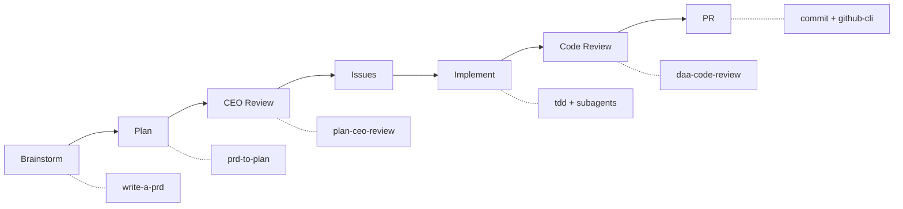

# Claude Workflow

     

A **Claude Code plugin** that gives any project a fully configured AI development environment — 20 skills, methodology docs, agents, and hooks — picked up in seconds by pasting a URL.

---

## Table of Contents

- [What Is This](#what-is-this)
- [Installation](#installation)
  - [Claude (Primary)](#claude-primary)
  - [Other Agents (Manual Copy-Paste)](#other-agents-manual-copy-paste)
- [Presets](#presets)
- [Skills](#skills)
  - [Universal Skills (20)](#universal-skills-20)
  - [Preset-Specific Skills](#preset-specific-skills)
- [Agents](#agents)
  - [Core Agents](#core-agents)
  - [Preset Agents](#preset-agents)
- [Methodology](#methodology)
- [Dev-Cycle Orchestrator](#dev-cycle-orchestrator)
  - [7-Phase Pipeline](#7-phase-pipeline)
  - [State Management](#state-management)
- [Development](#development)
  - [Architecture](#architecture)
  - [Build Pipeline](#build-pipeline)
  - [Folder Structure](#folder-structure)
  - [Scripts Reference](#scripts-reference)
  - [Running Tests](#running-tests)
- [Troubleshooting](#troubleshooting)
- [Contact](#contact)
- [License](#license)

---

## What Is This

Every project that uses **Claude Code** needs skills, hooks, settings, and development standards. Setting these up manually is repetitive and error-prone.

**Claude Workflow** is a Claude Code plugin that solves this. Paste the repo URL into Claude, pick a preset, and you get a fully configured environment with 20 skills, domain-specific agents, methodology docs, and hooks — installed automatically.

The plugin is organized into six **presets** for different project types (`python-api`, `data-pipeline`, `full-stack`, `claude-tooling`, `analysis`, `vault-ops`). Each preset is listed in `.claude-plugin/marketplace.json` and maps to a self-contained plugin directory under `dist/`. Claude reads this marketplace index and can install any preset on demand.

For teams using non-Claude agents (OpenAI, Cursor, etc.), the `dist/` output can also be copied manually.

---

## Installation

### Claude (Primary)

Paste the repo URL into Claude and tell it which preset you want:

```
https://github.com/cdcoonce/claude-workflow
```

Claude will read `.claude-plugin/marketplace.json`, find the available presets, and install the one you select into your project. No cloning or building required.

**Available presets:** `python-api` | `data-pipeline` | `full-stack` | `claude-tooling` | `analysis` | `vault-ops`

See [Presets](#presets) for what each one includes.

### Other Agents (Manual Copy-Paste)

For non-Claude agents, copy the pre-built plugin directory directly into your project:

```bash
# Replace python-api with your chosen preset
cp -r dist/python-api/ /path/to/your-project/.claude/plugins/python-api/
```

The `dist/` directories are self-contained — each one is a complete Claude Code plugin with `.claude-plugin/plugin.json`, skills, agents, hooks, settings, and a README.

> **Note:** If `dist/` is empty (it is gitignored), you need to build it first. See [Development](#development).

---

## Presets

| Preset               | Target                                  | Preset Skills                  | Preset Agents                                        | Key Conventions                            |
| -------------------- | --------------------------------------- | ------------------------------ | ---------------------------------------------------- | ------------------------------------------ |
| **`python-api`**     | Lambda, FastAPI, Flask backends         | `deploy`                       | `api-builder`, `security-reviewer`                   | Ruff linting, structured logging           |
| **`data-pipeline`**  | ETL/ELT, SQL transforms, scheduled jobs | `dagster-expert`, `dbt-expert` | `pipeline-builder`, `data-quality-reviewer`          | SQL lowercase, idempotent stages           |
| **`full-stack`**     | React/Next.js + Python backend          | —                              | `frontend-builder`, `backend-builder`, `ux-reviewer` | Dual test runners, fixture patterns        |
| **`claude-tooling`** | Claude skills, hooks, agents            | —                              | `skill-builder`, `skill-reviewer`                    | Skill structure requirements               |
| **`analysis`**       | Notebooks, R/Python scripts             | —                              | `analysis-builder`                                   | Reproducible seeds, documented assumptions |
| **`vault-ops`**     | My Brain vault sessions                 | `vault-*`                      | —                                                    | Frontmatter, wikilinks, handoff, sync      |

Project presets inherit the full set of 20 core skills, 2 core agents, 4 methodology docs, and the file-protection hook. Supplemental presets such as `vault-ops` can ship only their domain-specific skills.

Each preset's `manifest.json` controls which core components to include, which to exclude, and what preset-specific overrides to layer on top.

---

## Skills

### Universal Skills (20)

These ship with every preset:

| Skill                            | Trigger                             | Description                                                  |
| -------------------------------- | ----------------------------------- | ------------------------------------------------------------ |
| `/commit`                        | "commit", "save work"               | Conventional commit style enforcement                        |
| `/daa-code-review`               | "code review", "quality check"      | Python, Markdown, and Mermaid analysis                       |
| `/design-an-interface`           | "design it twice", API design       | Parallel sub-agents for interface comparison                 |
| `/dev-cycle`                     | "dev cycle", "development workflow" | Full 7-phase GitHub-issues-driven pipeline                   |
| `/dignified-python`              | "pythonic", type hints, code review | Production Python standards for 3.10-3.13                    |
| `/github-cli`                    | GitHub operations                   | Issues, PRs, branches, reviews via `gh`                      |
| `/grill-me`                      | "grill me", stress-test a plan      | Systematic interrogation via AskUserQuestion                 |
| `/improve-codebase-architecture` | architecture improvement            | Deep-module refactoring opportunities                        |
| `/plan-ceo-review`               | "CEO review", "mega review"         | 3-mode plan review (expand/hold/reduce scope)                |
| `/prd-to-issues`                 | "convert PRD to issues"             | Vertical-slice GitHub issue creation                         |
| `/prd-to-plan`                   | "break down PRD", "tracer bullets"  | Multi-phase implementation planning                          |
| `/project-context`               | "update project.md"                 | Generate `.claude/docs/project.md`                           |
| `/readme-generator`              | "README", "document this project"   | Codebase analysis + README generation                        |
| `/request-refactor-plan`         | "plan a refactor"                   | Tiny-commit refactor RFC as GitHub issue                     |
| `/security-review`               | "security review", "find vulns"     | OWASP-based vulnerability analysis with confidence reporting |
| `/setup-pre-commit`              | "set up pre-commit"                 | Pre-commit hooks for linting and formatting                  |
| `/tdd`                           | "red-green-refactor", TDD           | Test-driven development loop                                 |
| `/triage-issue`                  | "triage", bug report                | Root-cause investigation + issue creation                    |
| `/write-a-prd`                   | "write a PRD"                       | Interview-driven PRD as GitHub issue                         |
| `/write-a-skill`                 | "create a skill"                    | Skill authoring with proper structure                        |

### Preset-Specific Skills

| Preset          | Skill             | Description                                     |
| --------------- | ----------------- | ----------------------------------------------- |
| `python-api`    | `/deploy`         | Lambda/service deployment                       |
| `data-pipeline` | `/dagster-expert` | Expert guidance for Dagster and `dg` CLI        |
| `data-pipeline` | `/dbt-expert`     | Expert guidance for dbt Core and SQL transforms |
| `vault-ops`     | `/vault-*`        | My Brain vault command workflows                 |

---

## Agents

Agents are specialized role definitions (`AGENT.md` with YAML frontmatter) that give subagents domain expertise. Each agent is self-contained -- it declares a **role** (`implementer` or `reviewer`) and its own skill set directly via `skills.add`/`skills.remove` in the frontmatter.

### Core Agents

These ship with every preset:

| Agent                 | Role          | Skills            | Description                                      |
| --------------------- | ------------- | ----------------- | ------------------------------------------------ |
| **`tdd-implementer`** | `implementer` | `tdd`, `commit`   | Implements features using red-green-refactor TDD |
| **`code-reviewer`**   | `reviewer`    | `daa-code-review` | Reviews code for quality, structure, correctness |

### Preset Agents

Each preset adds domain-specific agents that override or extend the core set:

| Preset           | Agent                       | Role          | Description                          |
| ---------------- | --------------------------- | ------------- | ------------------------------------ |
| `python-api`     | **`api-builder`**           | `implementer` | FastAPI/Flask/Lambda specialist      |
| `python-api`     | **`security-reviewer`**     | `reviewer`    | Security-focused code review         |
| `data-pipeline`  | **`pipeline-builder`**      | `implementer` | ETL/ELT pipeline construction        |
| `data-pipeline`  | **`data-quality-reviewer`** | `reviewer`    | Data validation and quality review   |
| `full-stack`     | **`frontend-builder`**      | `implementer` | React/Next.js frontend development   |
| `full-stack`     | **`backend-builder`**       | `implementer` | Python backend API development       |
| `full-stack`     | **`ux-reviewer`**           | `reviewer`    | UX and accessibility review          |
| `claude-tooling` | **`skill-builder`**         | `implementer` | Claude skill/hook/MCP development    |
| `claude-tooling` | **`skill-reviewer`**        | `reviewer`    | Skill correctness and best practices |
| `analysis`       | **`analysis-builder`**      | `implementer` | Data analysis and notebook workflows |

A preset agent with the same name as a core agent **replaces** it (override semantics, not merge).

---

## Methodology

Four methodology documents in `core/docs/` define how Claude Code agents should work:

| Methodology              | Core Principle                                                               |
| ------------------------ | ---------------------------------------------------------------------------- |
| **TDD**                  | Write the test first. Watch it fail. Write minimal code to pass.             |
| **Root Cause Tracing**   | Never fix at the symptom. Trace backward to the original trigger.            |
| **Subagent Development** | Dispatch a fresh subagent per task with code review between each.            |
| **Parallel Agents**      | When 3+ unrelated failures need investigation, one agent per problem domain. |

---

## Dev-Cycle Orchestrator

The `/dev-cycle` skill orchestrates end-to-end feature development through GitHub issues.

### 7-Phase Pipeline



Every phase is mandatory. Each phase gates on a specific artifact (issue URL, plan file, approval, etc.) before advancing.

### State Management

- **State files** live at `docs/dev-cycle/{slug}.state.md` with YAML frontmatter
- **Resume** across conversations — scan for `status: in_progress` files
- **Archive** on completion — `git mv` state + plan files to `docs/archive/`
- **Backwards transitions** supported: `implement → plan` or `code_review → plan` when architectural issues arise

---

## Development

This section is for contributors who want to build presets from source, add new presets, or modify core components.

### Prerequisites

- **Python 3.12+**
- **[uv](https://docs.astral.sh/uv/)** — Python package manager

```bash
git clone https://github.com/cdcoonce/claude-workflow.git
cd claude-workflow
uv sync
```

### Architecture


Key design decisions:

- **Plugin format** — Output is a self-contained Claude Code plugin with `.claude-plugin/plugin.json`
- **Override semantics** — A preset skill or agent with the same name as a core one **replaces** it entirely
- **Settings merge** — Base and preset JSON are shallow-merged; hook arrays are appended, not replaced
- **Fail-fast validation** — All manifest references are checked upfront before any files are copied
- **Path containment safety** — Exclusion paths are resolved and verified to prevent directory traversal
- **Marketplace index** — `.claude-plugin/marketplace.json` lists all available plugins with their `dist/` sources, enabling Claude to discover and install presets by URL

### Build Pipeline

The build script assembles a self-contained plugin directory in 10 steps:


### Folder Structure

```
claude-workflow/
├── .claude-plugin/
│   └── marketplace.json     # Plugin registry — lists all presets with dist/ sources
├── core/                    # Universal components shared by all presets
│   ├── settings-base.json   # Base hook configuration
│   ├── agents/              # 2 universal agents (tdd-implementer, code-reviewer)
│   ├── docs/                # TDD, root-cause tracing, subagent, parallel agents
│   ├── hooks/               # File protection hook
│   └── skills/              # 20 universal skills
├── presets/                  # Project-type configurations
│   ├── python-api/          # Python backend services (+ api-builder, security-reviewer)
│   ├── data-pipeline/       # ETL/ELT pipelines (+ pipeline-builder, data-quality-reviewer)
│   ├── full-stack/          # React/Next.js + Python (+ frontend/backend-builder, ux-reviewer)
│   ├── claude-tooling/      # Claude skill/hook development (+ skill-builder, skill-reviewer)
│   ├── analysis/            # Notebooks, statistical analysis (+ analysis-builder)
│   └── vault-ops/           # My Brain vault lifecycle and graph workflows
├── scripts/                 # Build, marketplace, smoke-test, validation tooling
├── tests/                   # 93 pytest tests
├── dist/                    # Build output (gitignored)
├── docs/                    # Plans, archives, dev-cycle state
└── .claude/                 # Self-applicable template (dogfooding)
```

### Scripts Reference

| Command                                                       | Description                                                     |
| ------------------------------------------------------------- | --------------------------------------------------------------- |
| `uv run python -m scripts.build_preset <preset>`              | Assemble core + preset into `dist/<preset>/`                    |
| `uv run python -m scripts.build_marketplace`                  | Regenerate `.claude-plugin/marketplace.json`                    |
| `uv run python -m scripts.smoke_test <preset>`                | Validate internal consistency of a built preset                 |
| `uv run python -m scripts.dev_cycle_validate docs/dev-cycle/` | Validate dev-cycle state file frontmatter and phase transitions |

**Smoke test** checks: `.claude-plugin/plugin.json` has required fields, every skill has a `SKILL.md`, every agent has valid `AGENT.md` frontmatter, hook scripts referenced in `hooks.json` exist, and `settings.json` is valid JSON.

### Running Tests

```bash
# Run all tests
uv run pytest

# Run with coverage
uv run pytest --cov=scripts --cov-report=term-missing
```

---

## Troubleshooting

| Symptom                                        | Likely Cause                                                                            | Fix                                                                    |
| ---------------------------------------------- | --------------------------------------------------------------------------------------- | ---------------------------------------------------------------------- |
| `build_preset.py` fails with "skill not found" | Manifest references a skill that doesn't exist in `core/skills/` or `presets/*/skills/` | Check `manifest.json` `preset_skills` array against actual directories |
| Smoke test reports missing hook                | Hook listed in `hooks.json` but script not in `hooks/scripts/`                          | Add the hook script or remove from settings                            |
| Dev-cycle state file validation fails          | Frontmatter schema mismatch or phase transition error                                   | Check `schema_version: 1` and that phases follow strict order          |
| macOS "` 2`" duplicate files appear            | Prettier hook reformats files, then `git checkout` conflicts                            | Already mitigated via `.prettierrc` + `.gitignore` patterns            |

---

## Contact

For questions or support, contact:

- **Charles Coonce** — Charles.Coonce@clearwayenergy.com

---

## License

**Internal Use Only — Clearway Energy**

Proprietary software. All rights reserved.
