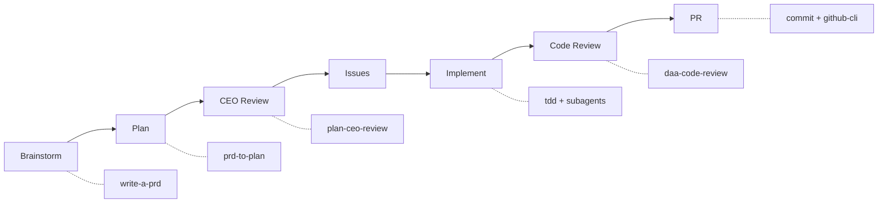
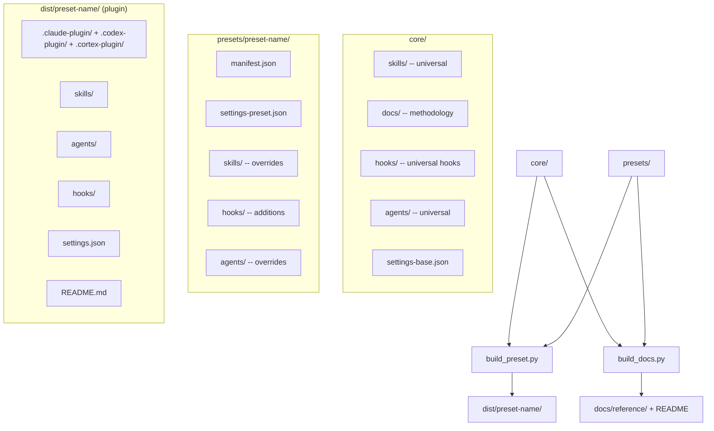

# The Workshop

     

A **portable AI development environment** — skills, methodology docs, agents, and hooks — that installs natively on **Claude Code**, **Codex**, and **Cortex Code** from one shared source. Picked up in seconds by pasting a URL. Skills run on all three platforms; plugin-level hooks execute on all three (trust-gated on Codex, env caveats on Cortex), while personas activate on Claude Code only today — see [Platform Support](#platform-support).

<!-- BEGIN GENERATED: counts -->
**79 skills · 16 agents · 15 hooks · 9 plugins**
<!-- END GENERATED: counts -->

> The counts and every component table below are generated from source by `scripts/build_docs.py`. Do not edit them by hand — run `make docs`. Deep reference lives in [`docs/reference/`](docs/reference/).

---

## Table of Contents

- [What Is This](#what-is-this)
- [Reference](#reference)
- [Platform Support](#platform-support)
- [Installation](#installation)
  - [Claude Code](#claude-code)
  - [Codex](#codex)
  - [Cortex Code (CoCo Desktop)](#cortex-code-coco-desktop)
  - [Any Other Agent (Manual Copy)](#any-other-agent-manual-copy)
- [Presets](#presets)
- [Skills](#skills)
  - [Universal Skills](#universal-skills)
  - [Preset-Specific Skills](#preset-specific-skills)
- [Agents](#agents)
  - [Core Agents](#core-agents)
  - [Preset Agents](#preset-agents)
- [Hooks](#hooks)
- [Methodology](#methodology)
- [Dev-Cycle Orchestrator](#dev-cycle-orchestrator)
  - [7-Phase Pipeline](#7-phase-pipeline)
  - [State Management](#state-management)
- [Development](#development)
  - [Architecture](#architecture)
  - [Build Pipeline](#build-pipeline)
  - [Living Documentation](#living-documentation)
  - [Folder Structure](#folder-structure)
  - [Scripts Reference](#scripts-reference)
  - [Running Tests](#running-tests)
- [Troubleshooting](#troubleshooting)
- [Contact](#contact)
- [License](#license)

---

## What Is This

Every coding-agent project needs skills, hooks, settings, and development standards. Setting these up by hand — and keeping them in sync across agents and repos — is repetitive and error-prone.

**The Workshop** solves this. It's a portable dev-environment toolkit that installs natively on **Claude Code**, **Codex**, and **Cortex Code**: the full skill set, every agent, methodology docs, and safety hooks, picked up by pasting a URL. Install **`workbench`** and you get the whole environment configured automatically.

**One shared source, three native outputs — with honest platform limits.** Every preset builds a plugin manifest for each platform — `.claude-plugin/` (read by Claude Code and Cortex Code), `.codex-plugin/` (Codex), and `.cortex-plugin/` (Cortex's documented convention; see [COMPATIBILITY.md](COMPATIBILITY.md)) — from the same components, with no install-time transform. Skills install and run on all three platforms. Plugin-level hooks execute on all three — behind a silent trust gate on Codex, and with env caveats on Cortex (`CLAUDE_PLUGIN_ROOT` unset) that break the current command strings there. Personas activate on Claude Code only today. The [Platform Support](#platform-support) matrix below is the per-component truth table.

The marketplace ships one main package plus focused extras. **`workbench`** is the everything package: every skill, every agent, all methodology docs, and the safety hooks. Alongside it are five **persona** plugins (voice/output-style layers) and **`vault-ops`** (a domain-specific package). Each maps to a self-contained plugin directory under `dist/`, indexed for Claude Code in `.claude-plugin/marketplace.json` and for Codex in `.agents/plugins/marketplace.json`.

---

## Reference

Complete, always-current reference for every component — generated from source, so it can't drift:

| Reference                                              | What's in it                                                   |
| ------------------------------------------------------ | -------------------------------------------------------------- |
| [Skills](docs/reference/skills.md)                     | Every universal and preset skill, with full descriptions       |
| [Agents](docs/reference/agents.md)                     | Subagent roles, their skill sets, and preset availability      |
| [Hooks](docs/reference/hooks.md)                       | Lifecycle hooks and the events they run on                     |
| [Presets](docs/reference/presets.md)                   | What each preset ships, plus its conventions                   |
| [Methodology](docs/reference/methodology.md)           | The working-method docs bundled into every preset              |
| [Build & Wiring](docs/reference/build-and-wiring.md)   | How the plugin is assembled and how hooks are wired            |
| [Platform Support](docs/reference/platform-support.md) | What each component class does on each platform, with evidence |
| [COMPATIBILITY.md](COMPATIBILITY.md)                   | Per-platform ground truth and how each claim was verified      |

---

## Platform Support

The per-component truth table — what actually runs where. Skills and plugin-level hooks are the portable layers (hooks with per-platform trust and env caveats); personas are Claude-Code-only today, and cells marked _Unverified_ mean no probe has been recorded, not "probably fine".

<!-- BEGIN GENERATED: platform-matrix -->
| Component | Claude Code | Codex | Cortex Code |
| --- | --- | --- | --- |
| Skills | Works | Works | Works |
| Agents | Works | Inert | Partial |
| Hooks (plugin-level) | Works | Works | Works |
| Personas (output styles) | Works | Inert | Inert |
| Settings (plugin-root settings.json) | Works | Inert | Unverified |
| Methodology docs | Works | Works | Works |

Per-cell notes and evidence: [platform support reference](docs/reference/platform-support.md); how each verdict was verified: [COMPATIBILITY.md](COMPATIBILITY.md).
<!-- END GENERATED: platform-matrix -->

---

## Installation

Every preset builds native plugin manifests for all three platforms from one shared source. Pick your platform below — and check [Platform Support](#platform-support) for what activates there. Most projects want **`workbench`** (the everything package); swap in a persona or `vault-ops` if you prefer.

### Claude Code

Paste the repo URL into Claude and ask for `workbench` (or a specific persona / `vault-ops`):

```
https://github.com/cdcoonce/the-workshop
```

Claude reads `.claude-plugin/marketplace.json`, finds the available packages, and installs the one you select into your project. No cloning or building required.

> **Prerequisites:** `bash` and `python3` on PATH — every project-preset hook runs through them. Persona plugins additionally need [`uv`](https://docs.astral.sh/uv/) for their SessionStart hook.

> **Headless:** plugin skills load under `claude -p` too, namespaced `<plugin>:<skill>` (re-verified 2026-08-09 on Claude Code 2.1.223, including with `--setting-sources project,local`) — no project-scope copies needed for scripted automation (see [COMPATIBILITY.md](COMPATIBILITY.md) → Claude Code → Headless).

See [Presets](#presets) for what each package includes, or the [presets reference](docs/reference/presets.md) for full detail.

### Codex

Register the marketplace, then install a package:

```bash
codex plugin marketplace add https://github.com/cdcoonce/the-workshop.git
```

```bash
codex plugin add workbench@the-workshop
```

Verify with `codex plugin list`. Skills load namespaced (`workbench:<skill>`) and work immediately, including under headless `codex exec` — skill discovery is not trust-gated.

> **What you get on Codex is skills, bundled docs, and plugin-level hooks.** Plugin-bundled hooks load when the plugin is enabled (corrected 2026-08-09 — an earlier entry read the retired `plugin_hooks` feature flag as a removed capability), but they sit behind a **silent trust gate**: Codex records trust against each hook definition's hash and skips unapproved hooks with no output and no error, so expect a re-approval prompt after every plugin update. Repo-level `.codex/hooks.json` additionally needs project trust (`trust_level = "trusted"` in `~/.codex/config.toml`). Don't rely on hook protections on Codex without reading [COMPATIBILITY.md](COMPATIBILITY.md) → Codex → Hooks. Persona plugins remain no-ops here for a different reason: their hook command interpolates `CLAUDE_PLUGIN_ROOT`, and Codex supplies `PLUGIN_ROOT` instead.

### Cortex Code (CoCo Desktop)

Use the GitHub Plugin Installer with a sub-path to install any preset directly:

```
/github-plugin-installer https://github.com/cdcoonce/the-workshop/tree/main/dist/<preset-name>
```

For example, to install `workbench`:

```
/github-plugin-installer https://github.com/cdcoonce/the-workshop/tree/main/dist/workbench
```

The plugin installs globally to `~/.snowflake/cortex/plugins/<preset-name>/` and activates automatically. Use the Sync button in Agent Settings to pull updates.

> **Skills work fully on Cortex, and plugin-level hooks execute** (probe-verified on 1.20.2, 2026-08-08 — superseding the earlier "never executed" finding from v1.1.8; see [COMPATIBILITY.md](COMPATIBILITY.md) → Cortex Code). Two caveats: `CLAUDE_PLUGIN_ROOT` is **unset** in Cortex's hook environment, so the Workshop's current hook commands (including persona injection) resolve against the wrong directory and fail there until a self-locating command form ships; and a restored window's first session fires SessionStart before plugin activation, so plugin SessionStart hooks always miss it.

### Any Other Agent (Manual Copy)

Each `dist/<preset-name>/` is a complete, self-contained plugin. The portable layer is `skills/` — copy it into your agent's verified skill root (a whole-plugin copy into `.claude/plugins/` is discovered by nothing):

```bash
# Claude Code project scope:
cp -r dist/workbench/skills/. /path/to/your-project/.claude/skills/
```

```bash
# Codex repo scope:
cp -r dist/workbench/skills/. /path/to/your-repo/.codex/skills/
```

Hooks and settings don't survive a manual copy — they need the platform's own plugin install (Claude Code) or a vendored repo-level wiring (Codex; see [COMPATIBILITY.md](COMPATIBILITY.md)).

---

## Presets

The marketplace ships one everything-package plus focused extras. **`workbench`** carries the complete set — every core skill, every core and preset agent, all methodology docs, and the base hooks plus the auto-format lint hook. **Persona** plugins are output-style-only (voice layers, no skills). **`vault-ops`** is a domain-specific package that ships only its own skills. The table below is generated from each package's manifest.

<!-- BEGIN GENERATED: plugins-table -->
| Plugin | Version | Skills | Agents | Hooks | Description |
| --- | --- | --- | --- | --- | --- |
| **`advisor-product-design`** | `0.2.0` | 1 | 0 | 0 | Product-design/UI-UX advisor persona — artifact-first design reviews with severity-tagged findings, named principles, and a stance contract that holds positions against pushback. Built by persona-builder. |
| **`advisor-product-strategy`** | `0.2.0` | 1 | 0 | 0 | Product-strategy sounding board and coach persona for a design+PM hybrid at an early-stage startup — decision stress-testing with a steelman duty, influence-case building, prioritization on thin evidence, and verdict-first design critique. Built by persona-builder. |
| **`persona-pair-programmer`** | `1.1.0` | 0 | 0 | 1 | Collaborative pair-programmer voice — brief think-aloud, checks in at decision points. |
| **`persona-ship-it`** | `1.1.0` | 0 | 0 | 1 | Momentum-first voice — blunt, bias-to-action, picks a sensible default and moves. |
| **`persona-staff-eng-deep`** | `1.1.0` | 0 | 0 | 1 | Senior-staff-engineer voice at full depth — reasoning, tradeoffs, and edge cases spelled out. |
| **`persona-terse-staff-eng`** | `1.1.0` | 0 | 0 | 1 | Terse senior-staff-engineer voice — answer-first, minimal, expert assumptions. The least verbose persona. |
| **`persona-thinking-partner`** | `1.1.0` | 0 | 0 | 1 | Socratic thinking partner — sharp questions and decision-sharpening over answers. |
| **`workbench`** | `4.0.0` | 70 | 10 | 10 | The complete Workshop toolkit — every skill, agent, methodology doc, and safety hook in one package, including the vault lifecycle, graph, capture, search, sync, and writing workflows. Skills and agents install on Claude Code, Codex, and Cortex Code; the safety hooks execute on Claude Code and Cortex Code. Plan, build, and ship with the full first-party dev workflow. |
| **`workshop-maintainer`** | `2.1.0` | 7 | 6 | 0 | Tools for auditing and maintaining The Workshop's skills, plugins, and distribution boundaries |
<!-- END GENERATED: plugins-table -->

Each preset's `manifest.json` controls which core components to include, which to exclude, what preset-specific overrides to layer on top, and the `conventions` shown above. See the [presets reference](docs/reference/presets.md) for the skills, agents, and hooks each one ships.

---

## Skills

<!-- BEGIN GENERATED: skills-table -->
| Skill | Plugin | Summary |
| --- | --- | --- |
| `/add-the-workshop-hook` | `workshop-maintainer` | Design and ship a new hook in this repo (the-workshop) — fetch the exact event schema, write a stdlib-only fail-open script, TDD it against real subprocess+git behavior, declare its wiring so the stamper picks it up, and push to both GitHub and GitLab. |
| `/adversarial-review` | `workbench` | Attacks finished work by trying to disprove what it claims, and reports what survives with the evidence. |
| `/advisor-product-design` | `advisor-product-design` | Product-design and UI/UX advisor for an engineer who ships real interfaces — data apps, dashboards, mobile, web. |
| `/advisor-product-strategy` | `advisor-product-strategy` | Product-strategy sounding board and coach for a design+PM hybrid at an early-stage startup — decision stress-testing, influence-case building, prioritization on thin evidence, and verdict-first design critique. |
| `/blueprint` | `workbench` | Charts an effort too big for one agent session as a shared map of decision tickets on the repo's issue tracker, worked one at a time until the way to the destination is clear. |
| `/brainstorm` | `workbench` | Shape a fuzzy idea into a committed direction before any plan, PRD, or code exists. |
| `/chart-taste` | `workbench` | Applies chart-design taste to React data visualization — a chart-type decision tree and adjustable dials (annotation density, complexity, color restraint) to stop charts from being technically-rendered-but-uninformative. |
| `/commit` | `workbench` | Git commit workflow with enforced conventional commit style. |
| `/create-hook` | `workbench` | Create and register Claude Code hooks (PreToolUse, PostToolUse) as Python scripts. |
| `/daa-code-review` | `workbench` | AI-powered code quality analysis for Python, Markdown, and Mermaid diagrams. |
| `/dagster-expert` | `workbench` | Expert guidance for working with Dagster and the dg CLI. |
| `/data-discovery` | `workbench` | Generate a handoff-ready data discovery document for a Snowflake schema or dbt project. |
| `/dbt-expert` | `workbench` | Expert guidance for working with dbt Core. |
| `/design-an-interface` | `workbench` | Generate multiple radically different interface designs for a module using parallel sub-agents. |
| `/detector-teeth-check` | `workbench` | Verify a test suite would actually catch the bug it claims to prevent, by re-injecting the defect and checking the suite goes red. |
| `/dev-cycle` | `workbench` | Use when user says "dev cycle", "development workflow", "full development pipeline", or invokes /dev-cycle to take a GitHub-issues-driven feature from brainstorm through a merged PR. |
| `/dignified-python` | `workbench` | Production Python coding standards with automatic version detection (3.10-3.13). |
| `/drain-queue` | `workbench` | Build a queue of filed, specced issues to empty by hand, one isolated worker per issue, with an adversarial spec gate before each build and a review of every diff before it lands. |
| `/finish-branch` | `workbench` | Use when implementation is complete, all tests pass, and you need to decide how to integrate a finished development branch — merge, open a PR, keep it, or discard it. |
| `/github-cli` | `workbench` | GitHub CLI (gh) integration for managing issues, pull requests, branches, commits, and code reviews directly from the terminal. |
| `/gitlab-cli` | `workbench` | GitLab CLI (glab) integration for managing issues, branches, merge request review, and CI/CD pipelines from the terminal. |
| `/gitlab-mr-create` | `workbench` | Create GitLab merge requests with `glab` using the `HEAD` conventional-commit subject as the exact title, a Markdown description file with real newlines, and API read-back verification. |
| `/gitlab-promotion-flow` | `workbench` | Integration and promotion policy for Clearway GitLab data repos (Dagster, dbt, ingestion). |
| `/grill-me` | `workbench` | Interview the user relentlessly about a plan or design until reaching shared understanding, resolving each branch of the decision tree. |
| `/improve-skill` | `workshop-maintainer` | Use when user says "improve skill", "benchmark skill", "make skill better", or invokes /improve-skill to raise a skill's benchmark pass rate before merging a PR. |
| `/land-skill-candidate` | `workshop-maintainer` | Take an already-identified skill candidate — a named gap or improvement surfaced against a skill this repo owns, often from a /wrap-up session or similar review elsewhere — and ship it into The Workshop: locate the canonical source, apply the smallest fix, run the full gate sequence, and land it via branch to PR to dev on GitHub. |
| `/mr-merge-order` | `workbench` | Use when several MRs or PRs are open against the same branch and the user asks which to merge first, whether one blocks another, why merging one breaks another, or in what order to land a queue. |
| `/mr-review-fixes` | `workbench` | Use when a user says an MR, PR, merge request, or pull request has review feedback, review comments, changes requested, an approval blocker, or asks to see what needs to be fixed, answered, or replied to after review. |
| `/persona-builder` | `workshop-maintainer` | Build an installable, portable, self-tuning coach/sounding-board persona for a named owner. |
| `/plan-ceo-review` | `workbench` | CEO/founder-mode review that rethinks a plan to find the 10-star product. |
| `/prd-to-issues` | `workbench` | Break a PRD into independently-grabbable GitHub issues using tracer-bullet vertical slices, with executor-ready issue bodies an autonomous agent can build from directly. |
| `/prd-to-plan` | `workbench` | Turn a PRD into a multi-phase implementation plan using tracer-bullet vertical slices, saved as a local Markdown file in docs/plans/. |
| `/project-context` | `workbench` | Generate or update the `.claude/docs/project.md` file that gives Claude project-specific context. |
| `/react-ui-ux` | `workbench` | Applies deliberate design taste to React UI generation — adjustable dials (variance, motion, density) and explicit anti-genericness rules to stop AI-generated components from defaulting to the generic shadcn/Tailwind look. |
| `/repo-reference-docs` | `workbench` | Create and maintain a repository's human-readable documentation — the root README.md front door and, when the repo warrants it, a deep reference set under docs/reference/ (architecture, module map, data flow, conventions). |
| `/request-refactor-plan` | `workbench` | Use when user wants to plan a refactor, create a refactoring RFC, break a refactor into safe incremental steps, or find architectural improvement opportunities (deepening shallow modules, consolidating tightly-coupled code, making a codebase more testable or AI-navigable). |
| `/security-review` | `workbench` | Security code review for vulnerabilities with confidence-based reporting. |
| `/setup-pre-commit` | `workbench` | Set up pre-commit hooks for the current repo. |
| `/shared-tree-safety` | `workbench` | Protect work when a git working tree or worktree may be shared with a live autonomous agent or another session. |
| `/skill-inventory` | `workshop-maintainer` | Audits agent skills and their package boundaries. |
| `/sql-deploy-precheck` | `workbench` | Compile-check committed warehouse SQL (Snowflake, BigQuery, Redshift) against the live schema before deploying it, catching column drift and views that will not build. |
| `/stale-artifact-sweep` | `workbench` | Use before acting on any recorded artifact — an issue, a review finding, a "do not merge" comment, a TODO or blocker doc, a plan prerequisite, a branch someone said still needs reviving. |
| `/sync-gitlab-dev` | `workshop-maintainer` | Push this repo's GitHub dev to GitLab as a reviewable merge request into GitLab dev, since GitLab is a manually-updated downstream copy (no auto-mirror bot) with its own 1-approval dev gate. |
| `/tdd` | `workbench` | Test-driven development with red-green-refactor loop. |
| `/transcript-notes` | `workbench` | Turn a YouTube lecture/talk or a raw transcript (VTT, SRT, or plain text) into a readable Obsidian-markdown study note — imposed structure, reconstructed LaTeX with plain-word glosses, flagged missing visuals, and per-section reading prompts. |
| `/triage-issue` | `workbench` | Use when user reports a bug, wants to file an issue, mentions "triage", or wants to investigate and plan a fix for a problem. |
| `/triage-quarantine` | `workbench` | Diagnose and resolve a failed, quarantined, or question-parked autonomous agent run, reusing its preserved work instead of rebuilding. |
| `/using-workflow` | `workbench` | Use when starting any conversation or task in this project — establishes precedence between instructions and skills, requires invoking any skill that might apply, and sets the order skills run in before any response or action. |
| `/vault-audit` | `workbench` | Run Charles's vault (The Vault) /vault-audit structural audit across frontmatter, wikilinks, indexes, stale notes, duplicates, and templates. |
| `/vault-budget` | `workbench` | Run Charles's vault (The Vault) /budget spend and subscription-value meter from local Claude transcripts. |
| `/vault-clickup-task-sync` | `workbench` | Run Charles's vault (The Vault) /clickup-task-sync workflow to sync vault action items into ClickUp without duplicating tasks. |
| `/vault-cold-read` | `workbench` | Run Charles's vault (The Vault) /cold-read gate — an adversarial read of a dispatched issue's SPEC (not its code) before it is promoted to the afk executor. |
| `/vault-connect` | `workbench` | Run Charles's vault (The Vault) /connect autonomous graph connection pass with preview-gated wikilink edits. |
| `/vault-context-then-delegate` | `workbench` | Run Charles's vault (The Vault) /context-then-delegate workflow to resolve real-world ambiguity (email/SharePoint/Slack) before writing a coding-agent prompt. |
| `/vault-debrief` | `workbench` | Run Charles's vault (The Vault) /debrief retrospective over recent afk builds. |
| `/vault-dispatch` | `workbench` | Run Charles's vault (The Vault) /dispatch workflow to turn a shaped idea into an afk-managed issue linked back into the vault. |
| `/vault-dump` | `workbench` | Run Charles's vault (The Vault) /dump capture workflow for routing freeform input into durable vault notes, tasks, indexes, and wikilinks. |
| `/vault-essay` | `workbench` | Draft long-form prose (essays and posts) in Charles's voice using The Vault's /essay writing rules. |
| `/vault-find` | `workbench` | Run Charles's vault (The Vault) /find semantic vault search workflow, including reindex and status modes. |
| `/vault-fix-issue` | `workbench` | Run Charles's vault (The Vault) /fix-issue workflow to resolve a filed issue under TDD + mutation-teeth-check + review-before-commit discipline. |
| `/vault-garden` | `workbench` | Run Charles's vault (The Vault) /garden graph-gardener apply workflow for queued link, profile, memory, index, and orphan repairs. |
| `/vault-grill` | `workbench` | Run Charles's vault (The Vault) /grill active knowledge-extraction interview and route the result into the vault graph. |
| `/vault-handoff` | `workbench` | Run Charles's vault (The Vault) /handoff workflow to refresh the machine-scoped rolling handoff digest. |
| `/vault-init` | `workbench` | Run Charles's vault (The Vault) /vault-init workflow to scaffold a brand-new second-brain vault from the-workshop's vault-ops machinery. |
| `/vault-link` | `workbench` | Run Charles's vault (The Vault) /link helper to find notes and suggest or insert correct Obsidian wikilinks. |
| `/vault-mr-review-packet` | `workbench` | Run Charles's vault (The Vault) /mr-review-packet workflow to generate a self-guided reviewer packet for a large merge request. |
| `/vault-pulse` | `workbench` | Run Charles's vault (The Vault) /pulse weekly work-quantification ledger from local activity data. |
| `/vault-recall` | `workbench` | Run Charles's vault (The Vault) /recall post-build consolidation workflow for afk merge outcomes, stubs, brag candidates, and handoff refresh. |
| `/vault-standup` | `workbench` | Run Charles's vault (The Vault) /standup context-loading workflow, including lean, deep, and comprehensive modes. |
| `/vault-sync` | `workbench` | Run Charles's vault (The Vault) /sync git synchronization workflow with rebase-before-push and conflict-safe handling. |
| `/vault-teach` | `workbench` | Run Charles's vault (The Vault) /teach stateful learning workspace workflow for a topic. |
| `/vault-upgrade` | `workbench` | Run Charles's vault (The Vault) /vault-upgrade workflow to re-vendor the vault's managed machinery from the-workshop with strict drift checks and per-file refusal triage. |
| `/vault-wrap-up` | `workbench` | Run Charles's vault (The Vault) /wrap-up session audit, handoff refresh, and git sync workflow. |
| `/vault-write` | `workbench` | Draft Outlook or Teams messages in Charles's voice using The Vault's /write communication rules. |
| `/walkthrough` | `workbench` | Interactive visual walkthrough of any artifact — repos, merge requests, emails, projects, or databases. |
| `/warehouse-sql-test-harness` | `workbench` | Stand up an in-process harness that executes committed warehouse SQL (Snowflake, BigQuery, Redshift) against DuckDB via sqlglot, so views and MERGE statements are proved by running them rather than by asserting on their text. |
| `/workshop-skill-creator` | `workshop-maintainer` | Creates and revises skills owned by The Workshop repository. |
| `/worktree-audit` | `workbench` | Inventory git worktrees across one repo or a whole directory of repos and classify each as reapable, keep, or too-recent, with the evidence that decided it. |
| `/write-a-prd` | `workbench` | Use when user wants to write a PRD, create a product requirements document, or plan a new feature. |
<!-- END GENERATED: skills-table -->

Full descriptions for every skill live in the [skills reference](docs/reference/skills.md).

---

## Agents

Agents are specialized role definitions (`AGENT.md` with YAML frontmatter) that give subagents domain expertise. Each agent is self-contained — it declares a **role** (`implementer`, `reviewer`, etc.) and its own skill set directly via `skills.add`/`skills.remove` in the frontmatter. A preset agent with the same name as a core agent **replaces** it (override semantics, not merge).

<!-- BEGIN GENERATED: agents-table -->
| Agent | Plugin | Role | Skills |
| --- | --- | --- | --- |
| **analysis-builder** | `workbench` | `implementer` | `tdd`, `commit` |
| **api-builder** | `workbench` | `implementer` | `tdd`, `commit` |
| **backend-builder** | `workbench` | `implementer` | `tdd`, `commit` |
| **code-reviewer** | `workbench` | `reviewer` | `daa-code-review`, `dignified-python` |
| **data-quality-reviewer** | `workbench` | `reviewer` | `daa-code-review`, `dagster-expert`, `dbt-expert`, `dignified-python` |
| **frontend-builder** | `workbench` | `implementer` | `tdd`, `commit`, `react-ui-ux` |
| **pipeline-builder** | `workbench` | `implementer` | `tdd`, `commit`, `dagster-expert`, `dbt-expert`, `dignified-python` |
| **qa-tester** | `workshop-maintainer` | `qa-tester` | — |
| **security-reviewer** | `workbench` | `reviewer` | `daa-code-review` |
| **skill-analyst** | `workshop-maintainer` | `analyst` | — |
| **skill-builder** | `workshop-maintainer` | `implementer` | `tdd`, `commit` |
| **skill-reviewer** | `workshop-maintainer` | `reviewer` | `daa-code-review` |
| **skill-writer** | `workshop-maintainer` | `skill-writer` | — |
| **strategy** | `workshop-maintainer` | `strategy` | — |
| **tdd-implementer** | `workbench` | `implementer` | `tdd`, `commit`, `dignified-python` |
| **ux-reviewer** | `workbench` | `reviewer` | `daa-code-review` |
<!-- END GENERATED: agents-table -->

See the [agents reference](docs/reference/agents.md) for full descriptions.

---

## Hooks

Hooks are scripts wired to Claude Code lifecycle events. The base set ships with every project preset; personas wire only their SessionStart injector. The event column is derived from the settings wiring, not the hook's name. **Plugin-level hooks execute on Claude Code only today** — Codex removed plugin hooks and Cortex never reads them (see [Platform Support](#platform-support)).

<!-- BEGIN GENERATED: hooks-table -->
| Hook | Plugin | Event | Summary |
| --- | --- | --- | --- |
| `audit-config-change.py` | `workbench` | `ConfigChange` | ConfigChange hook: audit-log and surface mid-session config file changes. |
| `inject-skill-router.py` | `workbench` | `SessionStart` | SessionStart hook: inject the skill router and preset conventions as additionalContext. |
| `inject_persona.py` | `persona-pair-programmer` | `SessionStart` | SessionStart hook: inject a persona output-style as additionalContext. |
| `inject_persona.py` | `persona-ship-it` | `SessionStart` | SessionStart hook: inject a persona output-style as additionalContext. |
| `inject_persona.py` | `persona-staff-eng-deep` | `SessionStart` | SessionStart hook: inject a persona output-style as additionalContext. |
| `inject_persona.py` | `persona-terse-staff-eng` | `SessionStart` | SessionStart hook: inject a persona output-style as additionalContext. |
| `inject_persona.py` | `persona-thinking-partner` | `SessionStart` | SessionStart hook: inject a persona output-style as additionalContext. |
| `post-edit-lint.py` | `workbench` | `PostToolUse` | Post-edit hook: auto-format and lint edited files with whatever toolchain is |
| `protect-files.py` | `workbench` | `PreToolUse` | Pre-edit hook: block edits to sensitive/generated files. |
| `remind-skill-announce.py` | `workbench` | `PostToolUse` | PostToolUse hook: remind Claude to announce a skill it just invoked. |
| `snapshot-subagent-start.py` | `workbench` | `SubagentStart` | SubagentStart hook: record a git baseline for the evidence check at stop. |
| `suggest-handoff-on-context.py` | `workbench` | `UserPromptSubmit` | UserPromptSubmit hook: suggest /handoff once the session's context grows large. |
| `verify-subagent-evidence.py` | `workbench` | `SubagentStop` | SubagentStop hook: catch a subagent claiming a change it never made. |
| `verify-tests-before-stop.py` | `workbench` | `Stop` | Stop hook: verify the project's test suite is green before Claude stops. |
| `warn-off-trunk.py` | `workbench` | `SessionEnd` | SessionEnd hook: warn when a session ends with HEAD off the repo's trunk branch. |
<!-- END GENERATED: hooks-table -->

See the [hooks reference](docs/reference/hooks.md) and [build & wiring reference](docs/reference/build-and-wiring.md) for details.

---

## Methodology

Methodology documents in `core/docs/` define how Claude Code agents should work. They are bundled into every preset under `docs/`:

<!-- BEGIN GENERATED: methodology-table -->
| Document | Plugin | Summary |
| --- | --- | --- |
| [`agent-matching.md`](../../plugins/workbench/docs/agent-matching.md) | `workbench` | This document is the canonical specification for how orchestrators select agents when dispatching subagents. All orchestrators — dev-cycle, subagent-development, parallel-agents — follow this algorithm. |
| [`parallel-agents.md`](../../plugins/workbench/docs/parallel-agents.md) | `workbench` | When you have multiple unrelated failures (different test files, different subsystems, different bugs), investigating them sequentially wastes time. Each investigation is independent and can happen in parallel. |
| [`root-cause-tracing.md`](../../plugins/workbench/docs/root-cause-tracing.md) | `workbench` | Bugs often manifest deep in the call stack (file created in wrong location, database opened with wrong path). Your instinct is to fix where the error appears, but that's treating a symptom. |
| [`subagent-development.md`](../../plugins/workbench/docs/subagent-development.md) | `workbench` | Execute a plan by dispatching a fresh subagent per task, with code review after each. |
| [`tdd.md`](../../plugins/workbench/docs/tdd.md) | `workbench` | Write the test first. Watch it fail. Write minimal code to pass. |
<!-- END GENERATED: methodology-table -->

Full summaries are in the [methodology reference](docs/reference/methodology.md).

---

## Dev-Cycle Orchestrator

The `/dev-cycle` skill orchestrates end-to-end feature development through GitHub issues.

### 7-Phase Pipeline


```mermaid
flowchart LR
    B[Brainstorm] --> P[Plan]
    P --> R[CEO Review]
    R --> I[Issues]
    I --> IM[Implement]
    IM --> CR[Code Review]
    CR --> MR[PR]

    B -.- PRD["write-a-prd"]
    P -.- PTP["prd-to-plan"]
    R -.- CEO["plan-ceo-review"]
    IM -.- TDD["tdd + subagents"]
    CR -.- REV["daa-code-review"]
    MR -.- GL["commit + github-cli"]
```

Every phase is mandatory. Each phase gates on a specific artifact (issue URL, plan file, approval, etc.) before advancing.

### State Management

- **State files** live at `docs/dev-cycle/{slug}.state.md` with YAML frontmatter
- **Resume** across conversations — scan for `status: in_progress` files
- **Archive** on completion — `git mv` state + plan files to `docs/archive/`
- **Backwards transitions** supported: `implement → plan` or `code_review → plan` when architectural issues arise

---

## Development

This section is for contributors who want to build presets from source, add new presets, or modify core components.

### Prerequisites

- **Python 3.12+**
- **[uv](https://docs.astral.sh/uv/)** — Python package manager

```bash
git clone https://github.com/cdcoonce/the-workshop.git
cd the-workshop
uv sync
```

### Architecture


```mermaid
graph TD
    CORE[core/] --> BUILD[build_preset.py]
    PRESETS[presets/] --> BUILD
    BUILD --> DIST[dist/preset-name/]

    CORE --> DOCS[build_docs.py]
    PRESETS --> DOCS
    DOCS --> REF[docs/reference/ + README]

    subgraph "core/"
        SKILLS_CORE[skills/ -- universal]
        DOCS_CORE[docs/ -- methodology]
        HOOKS_CORE[hooks/ -- universal hooks]
        AGENTS_CORE[agents/ -- universal]
        BASE_JSON[settings-base.json]
    end

    subgraph "presets/preset-name/"
        MANIFEST[manifest.json]
        PRESET_JSON[settings-preset.json]
        SKILLS_PRESET[skills/ -- overrides]
        HOOKS_PRESET[hooks/ -- additions]
        AGENTS_PRESET[agents/ -- overrides]
    end

    subgraph "dist/preset-name/ (plugin)"
        OUT_PLUGIN[".claude-plugin/ + .codex-plugin/ + .cortex-plugin/"]
        OUT_SKILLS[skills/]
        OUT_AGENTS[agents/]
        OUT_HOOKS[hooks/]
        OUT_SETTINGS[settings.json]
        OUT_README[README.md]
    end
```

Key design decisions:

- **Plugin format** — Output is a self-contained plugin that ships a manifest per platform convention (`.claude-plugin/`, `.codex-plugin/`, `.cortex-plugin/`); note Cortex also reads `.claude-plugin/`, and which manifest each platform actually consumes is recorded in [COMPATIBILITY.md](COMPATIBILITY.md)
- **Override semantics** — A preset skill or agent with the same name as a core one **replaces** it entirely
- **Settings merge** — Base and preset JSON are shallow-merged; hook arrays are appended, not replaced
- **Fail-fast validation** — All manifest references are checked upfront before any files are copied
- **Path containment safety** — Exclusion paths are resolved and verified to prevent directory traversal
- **Marketplace index** — `.claude-plugin/marketplace.json` lists all available plugins with their `dist/` sources, enabling Claude to discover and install presets by URL
- **Generated docs** — `build_docs.py` renders the reference and README component tables from source, gated on staleness so they can't drift

### Build Pipeline

The build script assembles a self-contained plugin directory:


```mermaid
flowchart LR
    A[Read manifest.json] --> B[Validate references]
    B --> C[Copy core skills/agents]
    C --> D[Copy preset skills/agents -- overrides core]
    D --> E[Copy hook scripts]
    E --> F[Generate hooks/hooks.json]
    F --> G[Generate settings.json]
    G --> H[Generate plugin manifests]
    H --> I[Apply exclusions]
    I --> J[Generate README.md]
    J --> K["dist/{preset}/ (plugin)"]
```

### Living Documentation

The reference docs and the README component tables are **generated from source**, not hand-maintained, so they can't drift from the components as the repo evolves.

- `make docs` runs `scripts/build_docs.py`, which reads SKILL.md/AGENT.md frontmatter, hook docstrings, settings wiring, and preset manifests, then writes the `docs/reference/` catalogs and rewrites the `<!-- BEGIN/END GENERATED -->` regions of this README and `docs/reference/build-and-wiring.md`.
- `make build` regenerates the marketplace index and rebuilds every preset into `dist/`.
- `make test` runs the suites **and** the drift gate: it runs `build_docs --check`, rebuilds `dist/`, and fails if any generated output differs from what's committed. The same gate runs in CI.

When you add or change a skill, hook, agent, or preset, run `make docs && make build && make test` and commit the regenerated docs and `dist/` alongside your change. The maintainer skills (`workshop-skill-creator`, `add-the-workshop-hook`) end with this step; `create-hook` remains the general-purpose hook workflow.

### Folder Structure

```
the-workshop/
├── .claude-plugin/
│   └── marketplace.json     # Plugin registry — lists all presets with dist/ sources
├── .github/workflows/       # CI — runs make test (suites + drift gate)
├── core/                    # Universal components shared by all presets
│   ├── settings-base.json   # Base hook configuration
│   ├── agents/              # Universal agents
│   ├── docs/                # Methodology docs (TDD, root-cause, subagent, parallel, agent-matching)
│   ├── hooks/               # Universal hook scripts
│   └── skills/              # Universal skills
├── presets/                  # Project-type configurations (+ persona plugins)
├── scripts/                 # Build, docs, marketplace, smoke-test, validation tooling
├── tests/                   # pytest suite
├── dist/                    # Built plugins (committed, gated against drift)
├── docs/
│   ├── reference/           # Generated component reference (skills, hooks, agents, presets, ...)
│   ├── plans/               # Plans and archives
│   └── dev-cycle/           # Dev-cycle state
└── .claude/                 # Self-applicable template (dogfooding)
```

### Scripts Reference

| Command                                                       | Description                                                      |
| ------------------------------------------------------------- | ---------------------------------------------------------------- |
| `make docs`                                                   | Regenerate `docs/reference/` and the README's generated tables   |
| `make build`                                                  | Regenerate the marketplace and rebuild every preset into `dist/` |
| `make test`                                                   | Run the suites plus the docs+dist drift gate                     |
| `uv run python -m scripts.build_docs [--check]`               | Generate docs, or check for staleness (`--check`)                |
| `uv run python -m scripts.build_preset <preset>`              | Assemble core + preset into `dist/<preset>/`                     |
| `uv run python -m scripts.build_marketplace`                  | Regenerate `.claude-plugin/marketplace.json`                     |
| `uv run python -m scripts.smoke_test <preset>`                | Validate internal consistency of a built preset                  |
| `uv run python -m scripts.dev_cycle_validate docs/dev-cycle/` | Validate dev-cycle state file frontmatter and phase transitions  |

### Running Tests

```bash
# Full gate (suites + drift check)
make test

# Just the root pytest suite
uv run pytest

# With coverage
uv run pytest --cov=scripts --cov-report=term-missing
```

---

## Troubleshooting

| Symptom                                         | Likely Cause                                                                            | Fix                                                                    |
| ----------------------------------------------- | --------------------------------------------------------------------------------------- | ---------------------------------------------------------------------- |
| `build_preset.py` fails with "skill not found"  | Manifest references a skill that doesn't exist in `core/skills/` or `presets/*/skills/` | Check `manifest.json` `preset_skills` array against actual directories |
| `make test` fails with "Documentation is stale" | A component changed but docs/dist weren't regenerated                                   | Run `make docs && make build` and commit the regenerated output        |
| Smoke test reports missing hook                 | Hook listed in `hooks.json` but script not in `hooks/scripts/`                          | Add the hook script or remove from settings                            |
| Dev-cycle state file validation fails           | Frontmatter schema mismatch or phase transition error                                   | Check `schema_version: 1` and that phases follow strict order          |

---

## Contact

For questions or support, contact:

- **Charles Coonce** — Charles.Coonce@clearwayenergy.com

---

## License

**Internal Use Only — Clearway Energy**

Proprietary software. All rights reserved.
