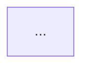

# Root README structure

The template and writing rules for the front-door `README.md`. Scale depth to
the project — include the sections that apply, drop the ones that do not, and
put `---` horizontal rules between major sections.

The README is the shallow, orienting door. When `docs/reference/` exists, link
to it from the overview instead of repeating its depth here.

---

## Section template

````markdown
# Project Name

  

Brief, clear description. Use **bold** to highlight the key technology or product type.

---

## Table of Contents

A nested list of every `##` and `###` heading, sub-sections indented under their
parents. On a long README the TOC doubles as the document outline, so do not skip
sub-sections.

- [Overview](#overview)
- [Architecture](#architecture)
  - [High-Level Architecture](#high-level-architecture)
  - [Folder Structure](#folder-structure)
- [Getting Started](#getting-started)
  - [Prerequisites](#prerequisites)
  - [Installation](#installation)
  - [Running Tests](#running-tests)
- [Environment Variables](#environment-variables)
- [Usage](#usage)
- [Troubleshooting](#troubleshooting)
- [Contact](#contact)
- [License](#license)

---

## Overview

Expand on the description. Bold key terms. Numbered lists for multi-step processes.
Link to `docs/reference/` here when that set exists.

---

## Architecture

### High-Level Architecture



### Folder Structure

```
project-root/
├── src/           # Brief annotation
├── tests/         # Brief annotation
└── ...
```

### Data Flow / Pipeline / Module Dependencies

Additional diagrams where they earn their space.

---

## Getting Started

### Prerequisites

### Installation

### Running Tests

---

## Environment Variables

| Variable | Required | Description                  |
| -------- | -------- | ---------------------------- |
| `DB_URL` | Yes      | PostgreSQL connection string |

---

## Usage

Real, runnable examples for the 2-3 most common operations.

---

## API Reference

Only if the project exposes one.

---

## Troubleshooting

| Symptom         | Likely Cause | Fix           |
| --------------- | ------------ | ------------- |
| `error message` | What's wrong | How to fix it |

---

## Contact

- **Name** — email@company.com

---

## License

**Internal Use Only – Company Name**
Proprietary software. © [Year] [Company]. All rights reserved.
````

---

## Writing rules

- **Be specific over generic.** "Run `npm run dev`" beats "Start the development
  server." Use actual commands, file paths, and variable names.
- **Write for the new team member.** General engineering skill, zero project context.
- **Bold key terms and product names** on first mention and in overviews, so the
  page can be scanned.
- **Numbered lists for sequential processes**, verb bolded: "1. **Extracts** data
  from X. 2. **Transforms** it. 3. **Loads** into Y."
- **Code examples must be runnable** — copy them from the codebase.
- **List every environment variable.** The table is not optional.
- **Troubleshooting is a table** (Symptom | Likely Cause | Fix).
- **Folder annotations are one short phrase** per directory.
- **Always include a Contact section.** Ask who maintains the project.
- Badges: 3-6, directly under the title — see [badge-reference.md](badge-reference.md).
- Diagrams: 3-6 for a typical project, more for multi-service or pipeline repos —
  see [mermaid-guidelines.md](mermaid-guidelines.md).

---

## Front-door anchors

A README goes stale on a specific, small set of files: dependency manifests, env
templates, CI configs, and entry points. Those are what its `covers` list records
— not every source file the deep docs cover.
