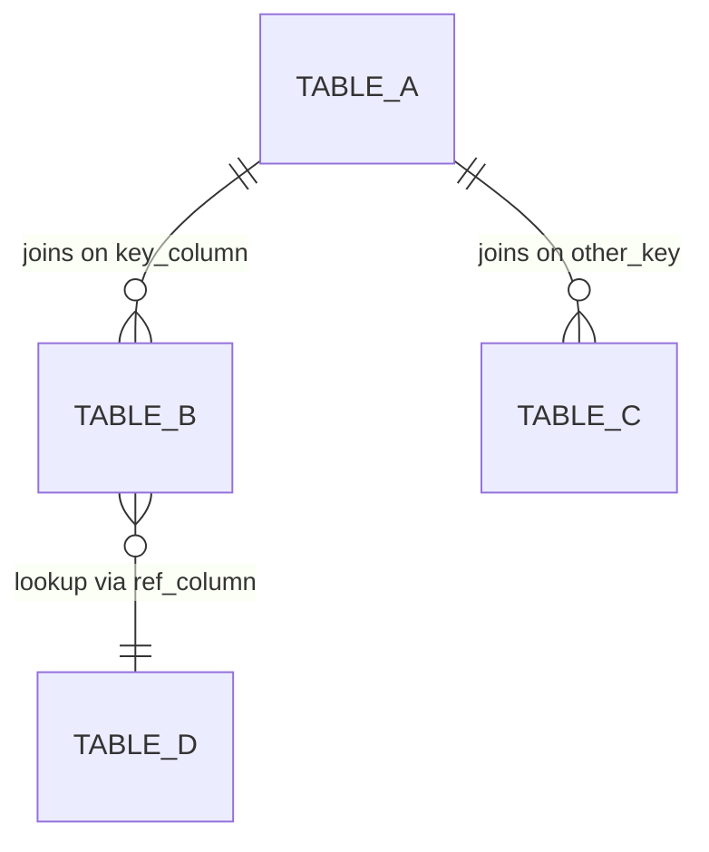

# Output Template

The discovery doc follows this structure. Sections marked `[if profiling]` are only included when live profiling is enabled. Adapt voice to the audience setting.

---

```markdown
---
date: <YYYY-MM-DD>
description: "<one-line summary of what data this documents>"
tags:
  - data-discovery
  - <project-or-schema-tag>
---

# <Project/Schema Name> — Data Discovery

<1-2 sentence overview: what this data is, where it lives, who owns it.>

## Table Inventory

| Table | Purpose | Rows | Key Columns |
|-------|---------|------|-------------|
| `TABLE_NAME` | <description> | <row count or "—"> | <2-3 important columns> |
| ... | ... | ... | ... |

Full path: `DATABASE.SCHEMA.TABLE_NAME`

## Data Coverage

[if profiling]

- **Sources:** <list of distinct values in the primary source/category column>
- **Categories:** <list of distinct values in key categorical columns>
- **Date range:** <earliest> to <latest>
- **Freshness:** last loaded <timestamp or "N hours ago">
- **Total records:** <count>

[end if]

## Relationships



<Plain English explanation of how the tables relate — 2-4 sentences.>

## Discovery Queries

### 1. <Plain English question this answers>

```sql
SELECT ...
FROM DATABASE.SCHEMA.TABLE
...;
```

### 2. <Plain English question>

```sql
...
```

<Continue for 5-10 queries covering: overview/counts, categorical breakdowns, date ranges, freshness, sample rows, joins between tables, and any domain-specific interesting cuts.>

## Notes

- <Non-obvious relationships, enrichment joins, identity resolution, caveats>
- <Data quality notes — known gaps, columns with high null rates>
- <Lineage notes — where raw data comes from, how often it refreshes>
```

---

## Guidance for each section

### Table Inventory
- Include ALL tables in the selected layers, sorted by importance (marts first, then dims, then facts, then staging/raw).
- Row counts come from live profiling or `INFORMATION_SCHEMA.TABLES.ROW_COUNT`. If neither available, use "—".
- "Key Columns" = the 2-3 columns a new user would most want to know about (primary keys, main dimensions, key metrics).

### Data Coverage
- Only include if live profiling is enabled.
- For categorical columns: only list distinct values if there are fewer than 15. Otherwise say "N distinct values" with the top 5.
- Date range: use the most semantically meaningful date column (e.g., `queue_date` for a queue, not `_loaded_at`).

### Relationships
- Mermaid ER diagram. Use `erDiagram` for table relationships.
- Label each relationship with the join key or a short description.
- Keep to 10 or fewer relationships to stay readable. If more exist, show the most important and note "additional relationships exist between..." in the text.
- Escape special characters in table/column names.

### Discovery Queries
- Minimum 5, maximum 10 queries.
- Always include: overview/summary, categorical breakdown, date range/freshness, sample rows, and at least one join.
- Every query must be fully qualified (`DATABASE.SCHEMA.TABLE`) and immediately executable.
- Order from broadest (overview) to most specific (filtered/joined).
- For analyst audience: make the plain English header a complete question ("How many projects are in each state?") not a label ("By state").

### Notes
- Include anything that would trip up a new user: column naming conventions, NULL semantics, identity resolution logic, known data quality issues.
- If the data has enrichment from external sources (e.g., a GEOID lookup from Census data), explain the lineage.

## Frontmatter

Include frontmatter if the output destination is a vault or documentation system that uses it. Skip if writing to a generic repo `docs/` folder where frontmatter would be unexpected. When in doubt, include it.
